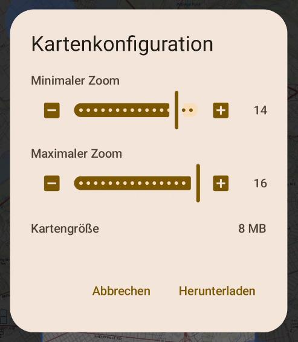
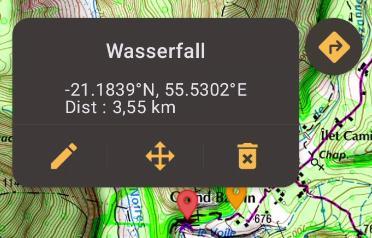
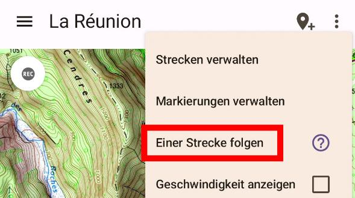

## Übersicht

1. [Überblick](#überblick)
2. [Funktionsübersicht](#funktionsübersicht)
3. [Eine Karte erstellen](#eine-karte-erstellen)
* [Einen Bereich auswählen](#einen-bereich-auswählen)
* [Aus einem Archiv importieren](#aus-einem-archiv-importieren)
* [Eine Karte empfangen](#kartenfreigabe)
* [Manuelle Kartenerstellung](#manuelle-kartenerstellung---der-schwere-weg)
4. [Funktionen](#funktionen)
* [Eine Entfernung messen](#eine-entfernung-messen)
* [Die Geschwindigkeit anzeigen](#die-geschwindigkeit-anzeigen)
* [Markierungen hinzufügen](#markierungen-hinzufügen)
* [Ein Orientierungspunkt hinzufügen](#ein-orientierungspunkt-hinzufügen)
* [Ansicht auf aktuellen Standort sperren](#ansicht-auf-aktuellen-standort-sperren)
* [Eine Aufzeichnung in Echtzeit visualisieren](#eine-aufzeichnung-in-echtzeit-visualisieren)
* [Eine GPX-Strecke importieren](#eine-gpx-strecke-importieren)
* [GPX-Aufzeichnung](#gpx-aufzeichnung)
* [Einer Strecke folgen](#einer-strecke-folgen)
5. [Einstellungen](#einstellungen)
* [Mit der letzten Karte starten](#mit-der-letzten-karte-starten)
* [Download-Ordner](#download-ordner)
* [Rotationsmodus](#rotationsmodus)
6. [Ihre Karten speichern](#ihre-karten-speichern)
7. [Ihre Karten teilen](#kartenfreigabe)
8. [Was soll ich tun, wenn...](doc/troubleshoot/troubleshoot.de.md)
   

## Überblick

TrekMe ist eine Android-Trekking-App, um die Live-Position auf einer Karte und andere nützliche Informationen zu erhalten, ohne jemals eine Internetverbindung zu benötigen (außer bei der Erstellung einer Karte).
TrekMe ist so konzipiert, dass es mit jeder WMTS-Quelle wie USGS in den USA, IGN Frankreich, Swiss topo, OpenStreetMap usw. funktioniert.
Sie können einen Bereich Ihrer Wahl herunterladen, sodass die zwischengespeicherten Kacheln für die Offline-Nutzung verfügbar sind.

Am wichtigsten ist vielleicht, dass TrekMe so _konzipiert_ ist, dass es nur wenige CPU-Ressourcen verbraucht, um die Batterie des Geräts zu schonen.

## Funktionsübersicht

* Unterstützung der In-App-Kartenerstellung von:
    - United States's USGS
    - France IGN (erfordert ein Abonnement)
    - Spain IGN
    - Swiss Topo
    - OpenStreetMap
* **Markierung**-Unterstützung (mit optionalen Kommentaren und Fotos)
* Import von GPX-**Strecken**
* Ansicht auf den aktuellen **Standort** sperren
* Orientierungsanzeige
* Geschwindigkeitsanzeige
* Entfernungsanzeige
* GPX-**Strecken**-Aufzeichnung

Einige Funktionen erfordern ein Premium-Abonnement, wie zum Beispiel:

* Erstellen Sie eine unbegrenzte Anzahl von Ordnern, um Ihre **Strecken** zu organisieren
* Entfernen Sie die Begrenzung der Kartengröße
* Fügen Sie **Signal-Sender** hinzu, um benachrichtigt zu werden, wenn Sie sich bestimmten **Standorten** nähern
* … und mehr

## Eine Karte erstellen

Es gibt drei Möglichkeiten, eine Karte zu erstellen:

1. Einen Bereich von einem offiziellen Anbieter wie IGN oder USGS auswählen,
2. Aus einem Archiv importieren,
3. Eine Karte von einem nahegelegenen TrekMe-Benutzer empfangen (über Wifi)

Die bevorzugte und einfachste Methode ist die erste. Nachfolgend werden diese Methoden im Detail beschrieben.

### Einen Bereich auswählen

In diesem Modus verwenden Sie einen bestimmten Kartenanbieter. Google Maps ist ein bekanntes Beispiel für einen Kartenanbieter. Deren Karten sind jedoch nicht ideal zum Wandern. Wenn möglich, ist es besser, Karten mit mehr Geländedetails zu verwenden.

Zum Beispiel ist USGS der offizielle Kartenanbieter der USA. Frankreichs IGN ist ideal, wenn Sie sich in Frankreich und seinen Territorien aufhalten. Allerdings verfügen nicht alle Länder über ähnliche Dienste.
OpenStreetMap hat eine weltweite Abdeckung. Insbesondere OpenStreetMap HD hat eine viel bessere Qualität.

Einige Anbieter erfordern ein Abonnement, um ihre Karten herunterzuladen. Die anderen sind für Karten von angemessener Größe kostenlos.

Über das Optionsmenü "Karte erstellen" können Sie zwischen den verfügbaren Anbietern wählen:

Wenn Sie Ihre Wahl getroffen haben, erscheint die Karte in Kürze. Beachten Sie, dass USGS nur detaillierte Ebenen für die USA bereitstellt. Tatsächlich decken andere Anbieter nur ihr jeweiliges Land ab, mit Ausnahme von OpenStreetMap, das die gesamte Welt abdeckt.

Von dort aus können Sie in den Bereich der Welt zoomen, den Sie erfassen möchten. Wenn dies nicht der praktischste Weg ist, um Ihren Interessensbereich zu finden, gibt es andere Möglichkeiten:

- Sie können mit der Standort-Schaltfläche oben auf Ihren aktuellen Standort zentrieren.
- Sie können mithilfe der Suchschaltfläche in der oberen Leiste nach einem bestimmten Ort suchen.
- Importieren Sie eine GPX-**Strecke** über das Menü oben rechts. Diese Funktion ist als Teil des Plus- und Pro-Angebots verfügbar.

Wenn Sie den gesuchten Ort gefunden haben, können Sie die Position der blauen Kreise anpassen, die den herunterzuladenden Bereich definieren. Wenn Sie bereit sind, drücken Sie die Schaltfläche "Bestätigen" am unteren Rand des Bildschirms.
Sie sehen dann das folgende Menü, von dem aus Sie den Download starten:

WMTS-Kartenanbieter haben unterschiedliche Zoomstufen, im Allgemeinen von 1 bis 18. In den meisten Fällen möchten Sie für Ihre Wanderung nicht die Stufen 1 bis 10, und Stufe 17 ist nicht immer notwendig. Sofern Sie nicht wissen, was Sie tun, wird empfohlen, die Standard-Voreinstellungen für die Stufen beizubehalten.

Die Anzahl der Kacheln, die heruntergeladen werden, hängt von der Größe des Bereichs sowie den minimalen und maximalen Stufen ab. Das Einfachste ist also, den herunterzuladenden Bereich anzupassen.
Die Anzahl der Kacheln nimmt zu, wenn der minimale Zoom niedrig und der maximale Zoom hoch ist. Dies wird durch die geschätzte Größe in MB angezeigt. Das Herunterladen von Hunderten von MB kann Stunden dauern...
Wählen Sie Ihren Bereich daher sorgfältig aus, um nur die Kacheln herunterzuladen, die Sie tatsächlich benötigen.

Drücken Sie abschließend die Download-Schaltfläche. Ein Download-Dienst wird gestartet und Sie erhalten eine Benachrichtigung. Über das Benachrichtigungscenter Ihres Android-Geräts können Sie entweder:

* Den Download-Fortschritt anzeigen,
* Den Download abbrechen

Wenn der Dienst den Download beendet, erhalten Sie eine Benachrichtigung und eine neue Karte ist in der Kartenliste verfügbar. Sie können ein Präsentationsbild festlegen, damit Sie die Karte in der Kartenliste leicht identifizieren können. Drücken Sie dazu die Bearbeitungsschaltfläche unten links auf der Kartenkarte (im Menü der Kartenliste).

Von der Kartenkonfigurationsansicht aus können Sie:

* Das Miniaturbild ändern,
* Den Namen ändern,
* Die Karte speichern

#### Einen gestoppten Download fortsetzen

Wenn ein Karten-Download gestoppt wurde (entweder manuell oder z. B. beim Herunterfahren des Geräts), ist die Karte nun unvollständig. Sie erkennen dies an der folgenden Warnung:

Sie können den Download fortsetzen, indem Sie BEARBEITEN > "Analysieren & reparieren" verwenden. Die Kartenreparatur ruft die fehlenden Kacheln ab. Dies ist möglich, wenn Sie TrekMe Plus oder Pro haben. Andernfalls wird empfohlen, die unvollständige Karte zu löschen.

### Aus einem Archiv importieren

Eine Karte kann auch aus einem vorhandenen Archiv erstellt werden. Das Archiv kann von Ihnen selbst oder jemand anderem erstellt worden sein (siehe unten zum Erstellen eines Archivs). Ein Archiv ist eine Zip-Datei.
Um aus einem Archiv zu importieren, verwenden Sie das Hauptmenü und wählen Sie "Karte importieren". Drücken Sie dann die Schaltfläche "Aus Ordner importieren" in der Mitte des Bildschirms. Navigieren Sie zu dem Ordner, der das/die Archiv(e) enthält, und wählen Sie diesen Ordner aus. Anschließend zeigt TrekMe Ihnen die erkannten Archive an, die Sie einzeln importieren können.

### Eine Karte empfangen

Siehe [Kartenfreigabe](#kartenfreigabe).

## Funktionen

### Eine Entfernung messen

Die Entfernung kann mit zwei verschiedenen Werkzeugen in TrekMe gemessen werden:

*Als-die-Krähe-fliegt-Entfernung*

Dies ist eine Option aus dem Menü oben rechts, während eine Karte angezeigt wird:
Passen Sie die Entfernung an, indem Sie zwei blaue Kreise ziehen.

*Entfernung entlang der Strecke*

Beim Folgen einer **Strecke** ist es manchmal praktisch, die Entfernung zwischen zwei Punkten auf dieser **Strecke** zu kennen. Sie können beispielsweise einschätzen, ob Sie genügend Zeit haben, einen bestimmten Punkt zu erreichen und dann vor Einbruch der Dunkelheit umzukehren.

Dies ist eine Option aus dem Menü oben rechts, während eine Karte angezeigt wird: "Entfernung auf **Strecke**". Sie kann aktiviert/deaktiviert werden. Wenn sie aktiviert ist, erscheinen zwei blaue Kreise auf der nächstgelegenen **Strecke** vom Zentrum des Bildschirms. Der Abschnitt der **Strecke** zwischen den beiden blauen Kreisen wird rot hervorgehoben und seine Entfernung angezeigt.

Die Entfernung berücksichtigt die Höhe *nur*, wenn die **Strecke** Höhendaten für jeden Punkt enthält.

### Die Geschwindigkeit anzeigen

Die Geschwindigkeitsanzeige überlagert die Geschwindigkeit in km/h oben auf dem Bildschirm. Beachten Sie, dass es einige Sekunden dauert, bis die Geschwindigkeit angezeigt werden kann.

### Markierungen hinzufügen

Drücken Sie die **Markierungs**-Schaltfläche, um eine neue **Markierung** in der Mitte des Bildschirms hinzuzufügen:

Die **Markierung** kann durch Ziehen des blauen Kreises verschoben werden. Wenn Sie mit ihrer Position zufrieden sind, tippen Sie einmal irgendwo auf den blauen Kreis.

Durch Tippen auf eine **Markierung** wird ein Popup angezeigt:

Von hier aus können Sie:

* Zur **Markierung** navigieren (über das Google Maps-Symbol oben rechts),
* Die **Markierung** bearbeiten (ihren Namen ändern, einen Kommentar oder ein Foto hinzufügen),
* Sie verschieben,
* Sie löschen

### Ein Orientierungspunkt hinzufügen

Ein Orientierungspunkt ist eine spezielle **Markierung**. Eine violette Linie wird zwischen ihm und Ihrem aktuellen **Standort** gezeichnet. Es hilft also, wenn Sie immer die Richtung eines bestimmten Ortes kennen müssen, der möglicherweise außerhalb des von Ihrem Bildschirm abgedeckten Bereichs liegt.

Oftmals möchten wir gleichzeitig unsere Orientierung anzeigen. Wir können auch mehrere Orientierungspunkte hinzufügen:

### Ansicht auf aktuellen Standort sperren

Manchmal möchten Sie, dass die Ansicht automatisch Ihrem **Standort** folgt. Dazu verwenden Sie das Menü wie unten gezeigt:

Wählen Sie dann "Auf Position sperren". Nun zentriert die Ansicht bei jeder **Standort**-Aktualisierung der Anwendung (etwa alle 2 Sekunden, bis zu 5 Sekunden) auf diesen neuen **Standort**.

### Eine Aufzeichnung in Echtzeit visualisieren

Wenn Sie eine Aufzeichnung über die Option "GPX-Aufzeichnung" starten, kann die Aufzeichnung in Echtzeit auf jeder Karte angezeigt werden, die Ihren aktuellen Bereich abdeckt. Sie erscheint als orangefarbene Route.

Selbst wenn Sie TrekMe schließen, finden Sie Ihre Live-Route beim nächsten Öffnen, bis Sie die Aufzeichnung stoppen.

### Eine GPX-Strecke importieren

Es gibt zwei verschiedene Möglichkeiten, eine GPX-**Strecke** zu importieren. Bei der ersten importieren Sie eine **Strecke** für eine bestimmte Karte, während Sie bei der zweiten eine **Strecke** für alle Karten importieren, die die **Strecke** anzeigen können.

#### GPX für eine bestimmte Karte importieren

Während Sie eine Karte anzeigen, drücken Sie die Menüschaltfläche oben rechts und wählen Sie dann "Strecken verwalten". Sie gelangen zum Bildschirm zur **Strecken**-Verwaltung. Drücken Sie von dort aus die Menüschaltfläche oben rechts und wählen Sie dann "GPX-Datei importieren".

#### GPX für alle Karten importieren

Wählen Sie im Hauptmenü > Meine Trails die Hauptschaltfläche unten rechts auf dem Bildschirm und dann "GPX-Dateien importieren".

Sie können dann die Datei(en) auswählen, die Sie importieren möchten. Die **Strecke**(n) werden dann für alle Karten importiert, die die **Strecke**(n) anzeigen können.

### GPX-Aufzeichnung

Es ist möglich, Ihren **Standort** aufzuzeichnen und eine GPX-Datei zu erstellen, um diese später in eine Karte zu importieren oder mit anderen Personen zu teilen.

Innerhalb jeder Karte befindet sich oben links eine Schaltfläche:

Die Aufzeichnung kann gestartet, gestoppt oder pausiert werden. Während der Aufzeichnung läuft der **Standort**dienst im Hintergrund. Er läuft weiter, auch wenn TrekMe gestoppt wird, bis Sie sich entscheiden, ihn zu stoppen.
Wenn Sie Android 10 oder höher haben, müssen Sie:

- Sicherstellen, dass die **Standort**berechtigung für TrekMe auf "Immer zulassen" und nicht nur bei Verwendung der App eingestellt ist.
- Sicherstellen, dass die Batterieoptimierung für TrekMe deaktiviert ist.

Andernfalls werden einige Punkte nicht aufgezeichnet und gerade Linien werden auf der **Strecke** erscheinen.

### Einer Strecke folgen

Manchmal möchten wir das Telefon so wenig wie möglich benutzen. Wir gehen jedoch das Risiko ein, einen falschen Weg einzuschlagen und dies etwas zu spät zu bemerken.

Um dieses Problem zu vermeiden, warnt Sie die **Strecken**folgefunktion, wenn Sie von der **Strecke** abkommen. Der Alarmschwellenwert beträgt standardmäßig 50 m, kann aber in den Einstellungen geändert werden. Diese Funktion ist nur mit Premium-Angeboten verfügbar.

Das **Strecken**folgen kann von jeder Karte aus über das Menü oben rechts gestartet werden:

Wählen Sie dann die zu verfolgende **Strecke** aus, indem Sie sie auf der Karte antippen. Die ausgewählte **Strecke** wird dann mit einem dünnen schwarzen Strich hervorgehoben:

Die **Strecken**folgefunktion läuft als Hintergrunddienst, der nur funktioniert, wenn alle folgenden Bedingungen erfüllt sind:
- Batterieoptimierung ist für TrekMe deaktiviert
- **Standort**berechtigung ist auf "Immer zulassen" eingestellt
- **Standort** ist auf dem Gerät aktiviert

## Einstellungen

Die Einstellungen sind über das Hauptmenü > Einstellungen zugänglich.

### Mit der letzten Karte starten

Standardmäßig startet TrekMe mit der Liste der Karten. Es ist jedoch möglich, mit der zuletzt angezeigten Karte zu starten. Im Abschnitt "Allgemein" > "TrekMe starten mit"

### Download-Ordner

Standardmäßig speichert TrekMe alles im internen Speicher. Wenn Sie jedoch eine SD-Karte haben **und** diese als tragbares Gerät eingebunden ist, können Sie sie zum Speichern einiger Ihrer Karten verwenden.

**Achtung**

Alle Ihre Karten auf der SD-Karte werden gelöscht, wenn TrekMe deinstalliert wird (dies wird von Android erzwungen).
Dies ist der Grund, warum dringend empfohlen wird, die Karten zu speichern, die Sie nicht verlieren möchten.
Weitere Informationen dazu finden Sie im Abschnitt "Ihre Karten speichern".

Im Abschnitt "Stammordner" > "Ausgewählter Ordner" können Sie zwischen zwei Verzeichnissen wählen, wenn Sie eine SD-Karte haben. Andernfalls können Sie nur den internen Speicher verwenden:

Das erste Verzeichnis entspricht immer dem internen Speicher. Das zweite, falls verfügbar, entspricht einem Verzeichnis auf der SD-Karte. Dieses Verzeichnis ist `Android/data/com.peterlaurence.trekme/downloaded`.

Sobald der Download-Ordner geändert wurde, wird Ihr nächster Karten-Download diesen verwenden. Vorhandene Karten werden jedoch nicht verschoben.

### Rotationsmodus

Drei Rotationsmodi stehen zur Verfügung:

* Keine Rotation (Standard)
* Nur bei Anzeige der Orientierung drehen
* Freie Rotation

*Nur bei Anzeige der Orientierung drehen*

In diesem Modus wird die Karte entsprechend der Ausrichtung Ihres Geräts gedreht, *wenn* Sie die Orientierungsanzeige aktivieren (während eine Karte angezeigt wird, im Menü oben rechts > Orientierung anzeigen).
Wenn die Orientierungsanzeige aktiviert ist, erscheint unten rechts auf dem Bildschirm ein kleiner Kompass – die rote Seite zeigt nach Norden. Sie können die Orientierungsanzeige jederzeit deaktivieren. In diesem Fall wird die Karte nach Norden ausgerichtet und der Kompass verschwindet. Beachten Sie auch, dass in diesem Modus das Drücken des Kompasses keine Wirkung hat. Ein Beispiel:

*Freie Rotation*

In diesem Modus können Sie die Karte nach Belieben drehen. Der Kompass wird immer angezeigt, und durch Drücken wird die Karte nach Norden ausgerichtet. Sie können die Orientierungsanzeige auch aktivieren oder deaktivieren – dies hat keine Auswirkungen auf die Ausrichtung der Karte.

### Ihre Karten speichern

Ab Android 10 werden alle Karten (unabhängig davon, ob sie sich auf dem internen Speicher oder der SD-Karte befinden) gelöscht, wenn TrekMe deinstalliert wird. Daher wird dringend empfohlen, die Sicherungsfunktion von TrekMe zu verwenden. Sie können Ihre Karten wiederherstellen, wenn Sie beispielsweise auf ein neues Gerät umsteigen.

Um ein Archiv zu erstellen, gehen Sie zur Kartenliste und zeigen Sie die Kartenoptionen entweder durch langes Drücken auf eine Karte oder über das Menü oben rechts > Kartenoptionen anzeigen.

In den Kartenoptionen finden Sie eine Schaltfläche "Speichern". Anschließend erklärt ein Dialog, dass Sie den Ordner auswählen werden, in dem das Archiv erstellt wird. Sie können einen beliebigen Ordner auswählen (oder einen neuen erstellen), aber wählen Sie kein Unterverzeichnis von TrekMe. Wenn Sie fortfahren, wird das Archiv im Hintergrund erstellt – Sie können den Fortschritt im Benachrichtigungsbereich des Geräts sehen.

Ein Archiv enthält alles, was mit der Karte zusammenhängt (Kalibrierung, Routen, Points of Interest usw.).

Nach der Archivierung kann eine Karte mithilfe der Importfunktion wiederhergestellt werden.

### Kartenfreigabe

Eine Karte ist manchmal umfangreich und das Herunterladen dauert einige Zeit. Wenn ein Freund ebenfalls TrekMe hat, ist es möglich, ihm/ihr eine Ihrer Karten zu senden. Diese Funktion erfordert, dass WLAN auf beiden Geräten aktiviert ist, auch wenn sich kein Router oder Hotspot in der Nähe befindet – der Sender kann direkt über WLAN an das Empfangsgerät senden. Stellen Sie sicher, dass die beiden Geräte relativ nahe beieinander bleiben. Auch wenn einige Übertragungen erfolgreich abgeschlossen wurden, als die Geräte mehrere Meter voneinander entfernt waren, hat die Erfahrung gezeigt, dass das Beieinanderhalten der beiden Geräte das Fehlerrisiko senkt.

Gehen Sie im Hauptmenü auf "Empfangen und senden". Es gibt eine Schaltfläche zum Empfangen und eine weitere zum Senden.
Wenn Sie den Empfang wählen, wartet das Gerät auf eine Verbindung mit dem Sender. Dieser Schritt kann einige Minuten dauern – bitte haben Sie Geduld. In der Zwischenzeit verwendet der Sender die Schaltfläche zum Senden und die zu sendende Karte.

Wenn die Verbindung hergestellt ist, beginnt die Übertragung und Sie können den Fortschritt sehen. Wenn alles gut geht, wird ein wunderschönes Emoticon angezeigt. Andernfalls, und insbesondere wenn die Übertragung unterbrochen wurde, wird Ihnen geraten, erneut zu beginnen (WLAN ist nicht 100% zuverlässig).

Wenn es wirklich zu lange dauert, bis die Geräte eine Verbindung herstellen (mehr als 5 Minuten), versuchen Sie, das Empfangen und Senden auf beiden Telefonen neu zu starten. Als letzte Möglichkeit starten Sie die beiden Geräte neu und versuchen Sie den Vorgang erneut.