

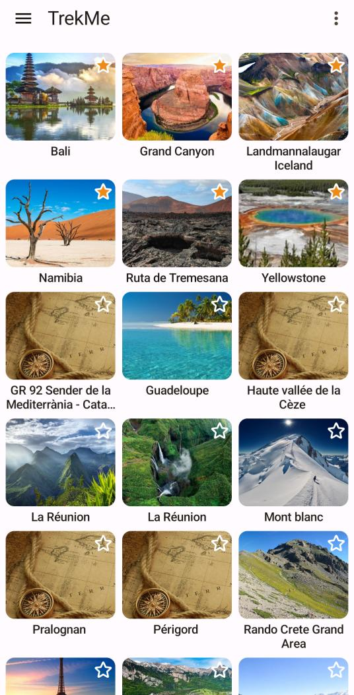 &nbsp&nbsp&nbsp 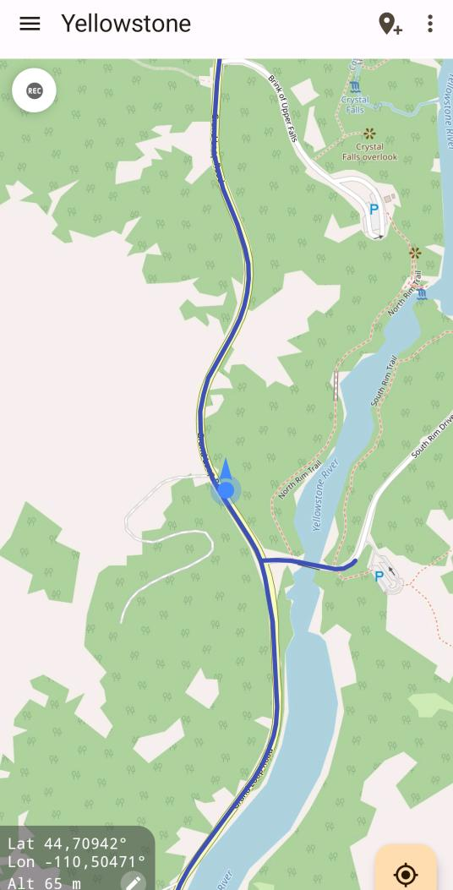

## Resumen

1. [Visión general](#visión-general)
2. [Resumen de características](#resumen-de-características)
3. [Crear un mapa](#crear-un-mapa)
* [Seleccionar un área](#seleccionar-un-área)
* [Desde un archivo](#importar-desde-un-archivo)
* [Recibir un mapa](#compartir-mapa)
* [Creación manual de mapas](#creación-manual-de-mapas---el-camino-difícil)
4. [Características](#características)
* [Medir una distancia](#medir-una-distancia)
* [Mostrar la velocidad](#mostrar-la-velocidad)
* [Añadir marcadores](#añadir-marcadores)
* [Añadir puntos de referencia](#añadir-puntos-de-referencia)
* [Fijar la vista en la ubicación actual](#fijar-la-vista-en-la-ubicación-actual)
* [Visualizar una grabación en tiempo real](#visualizar-una-grabación-en-tiempo-real)
* [Importar una ruta GPX](#importar-una-ruta-gpx)
* [Grabación GPX](#grabación-gpx)
* [Seguir una ruta](#seguir-una-ruta)
5. [Configuración](#configuración)
* [Iniciar en el último mapa](#iniciar-en-el-último-mapa)
* [Carpeta de descarga](#carpeta-de-descarga)
* [Modo de rotación](#modo-de-rotación)
6. [Guardar sus mapas](#guardar-sus-mapas)
7. [Compartir sus mapas](#compartir-mapa)
8. [¿Qué debo hacer cuando...](doc/troubleshoot/troubleshoot.es.md)

## Visión general

TrekMe es una aplicación de senderismo para Android que permite obtener la **ubicación** en directo en un mapa y otra información útil, sin
necesidad de conexión a internet (excepto al crear un mapa).
TrekMe está diseñada para funcionar con cualquier fuente WMTS como USGS en EE. UU., IGN Francia, Swiss topo,
OpenStreetMap, etc.
Puede descargar un área de su elección para que los mosaicos en caché estén disponibles para su uso sin conexión.

Quizás lo más importante es que TrekMe está *diseñada* para consumir pocos recursos de CPU, con el fin de preservar la batería del dispositivo.

---

## Resumen de características

* Soporte para la creación de mapas dentro de la aplicación desde:
    - USGS de Estados Unidos
    - IGN Francia (requiere suscripción)
    - IGN España
    - Swiss Topo
    - OpenStreetMap
* Soporte para **marcadores** (con comentarios y fotos opcionales)
* Importación de **rutas** GPX
* Fijar la vista en la **ubicación** actual
* Indicador de orientación
* Indicador de velocidad
* Indicador de distancia
* **Grabación GPX** de **rutas**

Algunas características requieren una suscripción premium, tales como:

* Crear un número ilimitado de carpetas para organizar sus **rutas**
* Eliminar el límite de tamaño del mapa
* Añadir **balizas** para ser alertado al acercarse a **ubicaciones** específicas
* … y más

---

## Crear un mapa

Hay tres formas de crear un mapa:

1. Seleccionar un área de un proveedor de fuente oficial como IGN o USGS,
2. Importar desde un archivo,
3. Recibir un mapa de un usuario de TrekMe cercano (a través de Wifi)

La forma preferida y más fácil es la primera. A continuación, se detallan cada uno de estos métodos.

### Seleccionar un área

En este modo, utiliza un proveedor de mapas específico. Google Maps es un ejemplo bien conocido de proveedor de mapas.
Pero sus mapas no son ideales para el senderismo. Cuando es posible, es mejor usar mapas con más detalles del terreno.

Por ejemplo, USGS es el proveedor de mapas oficial de EE. UU. El IGN de Francia es ideal cuando se está en Francia y
sus territorios. Sin embargo, no todos los países tienen un servicio similar.
OpenStreetMap tiene una cobertura mundial. En particular, OpenStreetMap HD tiene una calidad mucho mejor.

Algunos proveedores requieren una suscripción para descargar sus mapas. Los otros son gratuitos para mapas de
tamaño razonable.

Desde el menú de opciones "Crear mapa", puede elegir entre los proveedores disponibles:

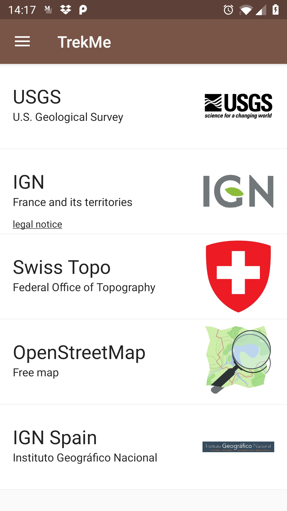

Cuando haya hecho su elección, el mapa aparecerá en breve. Tenga en cuenta que USGS solo proporciona niveles detallados para EE. UU.
De hecho, otros proveedores solo cubren su país relevante, excepto OpenStreetMap que cubre el mundo entero.

Desde allí, puede hacer zoom en el área del mundo que desea capturar. Si esta no es la forma más práctica
de encontrar su área de interés, hay otras formas:

- Puede centrarse en su **ubicación** actual, usando el botón de **ubicación** en la parte superior.
- Puede buscar un lugar en particular, usando el botón de búsqueda en la barra superior.
- Importar una **ruta** GPX, usando el menú en la esquina superior derecha. Esta característica está disponible como parte de la
  oferta Plus y Pro.

Cuando haya encontrado el lugar que está buscando, puede ajustar la posición de los círculos azules, que
definen el área a descargar. Cuando esté listo, presione el botón "Validar" en la parte inferior de la pantalla.
Luego verá el menú a continuación, desde donde comenzará la descarga.

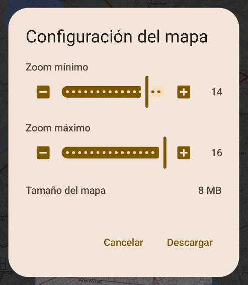

Los proveedores de mapas WMTS tienen diferentes niveles de zoom, generalmente de 1 a 18. En la mayoría de los casos, no querrá
los niveles 1 a 10 para su caminata, y el nivel 17 no siempre es necesario. A menos que sepa lo que está
haciendo, se recomienda mantener los ajustes preestablecidos de nivel por defecto.

El número de mosaicos que se descargarán depende del tamaño del área, y de los niveles mínimo y
máximo. Así que lo más sencillo es ajustar el área a descargar.
El número de mosaicos aumenta cuando el zoom mínimo es bajo y el zoom máximo es alto. Esto
se indica por el tamaño estimado en Mb. La descarga de cientos de Mb puede llevar horas...
así que elija cuidadosamente su área para descargar solo los mosaicos que realmente necesita.

Finalmente, presione el botón de descarga. Se inicia un servicio de descarga y recibe una notificación. Desde
el centro de notificaciones de su dispositivo Android, puede:

* Ver la progresión de la descarga,
* Cancelar la descarga

Cuando el servicio termina la descarga, recibe una notificación y un nuevo mapa está disponible en la lista de mapas.
Puede establecer una imagen de presentación para poder identificarlo fácilmente en la lista de mapas. Para hacerlo,
presione el botón de edición en la parte inferior izquierda de la tarjeta del mapa (en el menú de lista de mapas).

Desde la vista de configuración del mapa, puede:

* Cambiar la imagen en miniatura,
* Cambiar el nombre,
* Guardar el mapa

#### Reanudar una descarga detenida

Cuando una descarga de mapa se detuvo (ya sea manualmente o, por ejemplo, al apagar el dispositivo), el mapa está
ahora incompleto. Puede notarlo por la advertencia a continuación:

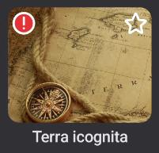

Puede reanudar la descarga usando EDITAR > "Analizar y reparar". La reparación del mapa buscará los
mosaicos faltantes. Esto es posible si tiene TrekMe Plus o Pro. De lo contrario, se recomienda eliminar el
mapa incompleto.

### Importar desde un archivo

Un mapa también se puede crear a partir de un archivo existente. El archivo puede ser hecho por usted mismo o por otra
persona (consulte a continuación para crear un archivo). Un archivo es un archivo zip.
Para importar desde un archivo, use el menú principal y elija "Importar un mapa". Luego, presione el botón
"Importar desde carpeta" en el medio de la pantalla. Navegue hasta la carpeta que contiene el/los archivo(s)
y seleccione esa carpeta. Luego, TrekMe le mostrará los archivos reconocidos, que puede importar
individualmente.

### Recibir un mapa

Consulte [Compartir mapa](#compartir-mapa).

---

## Características

### Medir una distancia

La distancia se puede medir utilizando dos herramientas diferentes en TrekMe:

*Distancia en línea recta*

Esta es una opción del menú superior derecho mientras visualiza un mapa:
Ajuste la distancia arrastrando dos círculos azules.

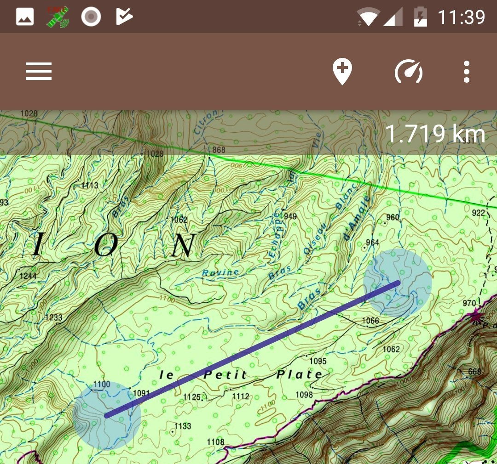

*Distancia a lo largo de la ruta*

Mientras sigue una **ruta**, a veces es útil saber la distancia entre dos puntos en esa **ruta**.
Por ejemplo, puede evaluar si tiene tiempo suficiente para llegar a algún punto, luego dar la vuelta antes de
que anochezca.

Esta es una opción del menú superior derecho mientras visualiza un mapa: "Distancia en **ruta**". Se puede
activar/desactivar. Cuando está habilitado, aparecen dos círculos azules en la **ruta** más cercana desde el centro de la
pantalla. La porción de la **ruta** entre los dos círculos azules se resalta en rojo y se muestra su
distancia.

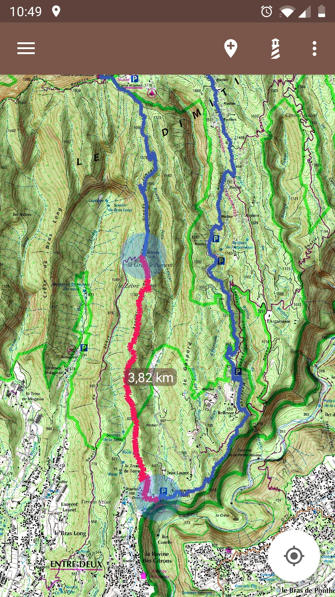

La distancia tiene en cuenta la elevación *solo si* la **ruta** contiene datos de elevación para cada punto.

### Mostrar la velocidad

El indicador de velocidad superpone la velocidad en km/h en la parte superior de la pantalla. Tenga en cuenta que requiere unos
pocos segundos antes de que se pueda mostrar la velocidad.

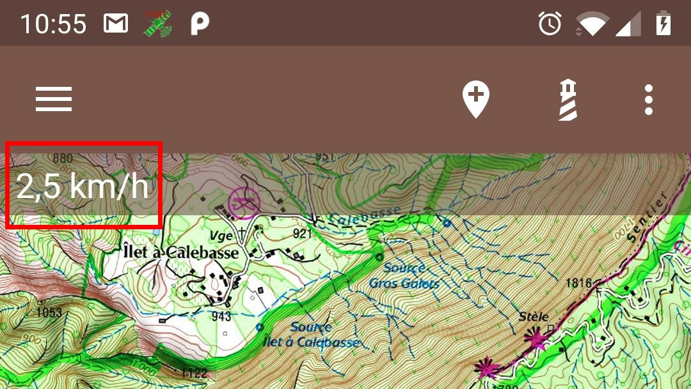

### Añadir marcadores

Presione el botón de **marcador** para añadir un nuevo **marcador** en el centro de la pantalla:

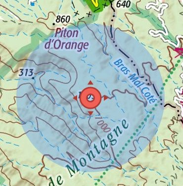

El **marcador** se puede mover arrastrando el círculo azul. Cuando esté satisfecho con su posición, toque
una vez en cualquier lugar del círculo azul.

Tocar un **marcador** muestra una ventana emergente:

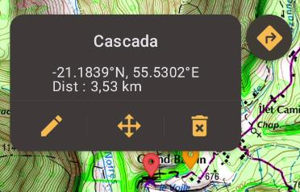

Desde aquí puede:

* Navegar hasta el **marcador** usando Google Maps (icono superior derecho),
* Editar el **marcador** (cambiar su nombre, añadir un comentario o una foto),
* Moverlo,
* Eliminarlo

### Añadir puntos de referencia

Un punto de referencia es un **marcador** específico. Una línea morada se dibuja entre él y su **ubicación** actual. Por lo tanto, ayuda cuando necesita saber siempre la dirección de un lugar específico, que puede estar fuera del área que cubre su pantalla.

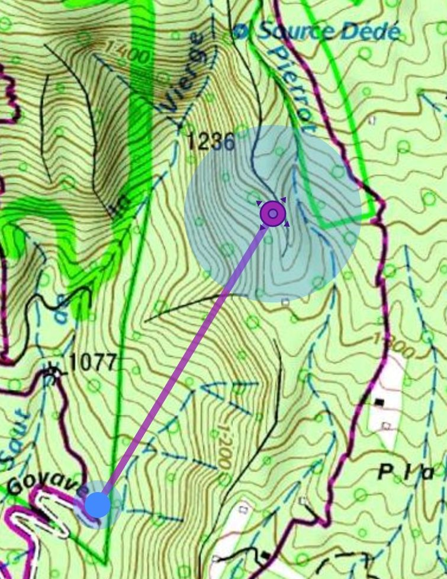

A menudo, queremos mostrar nuestra orientación al mismo tiempo. También podemos añadir varios puntos de referencia:

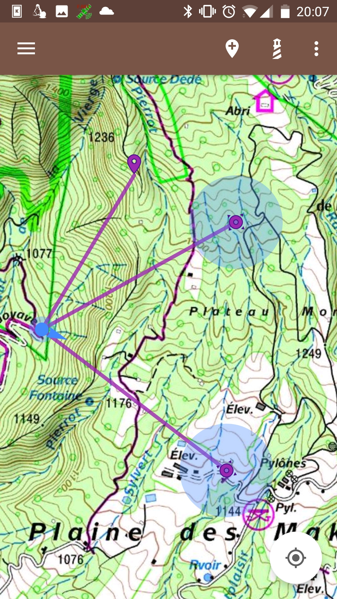

### Fijar la vista en la ubicación actual

A veces, desea que la vista siga automáticamente su posición. Para hacer eso, use el menú como se muestra a continuación:

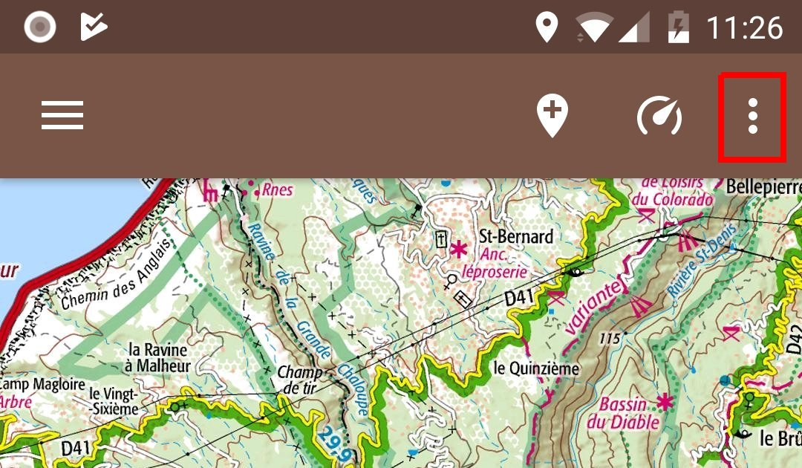

Luego seleccione "Fijar en **ubicación**". Ahora, cada vez que la aplicación obtenga una actualización de **ubicación** (aproximadamente
cada 2 segundos, hasta 5 segundos), la vista se centra en esta nueva **ubicación**.

### Visualizar una grabación en tiempo real

Cuando inicia una grabación desde el menú de opciones "**Grabación GPX**", la grabación se puede ver en tiempo real
en cualquier mapa que cubra su área actual. Aparece como una **ruta** naranja.

Incluso si cierra TrekMe, encontrará su **ruta** en directo la próxima vez que lo abra, hasta que detenga la grabación.

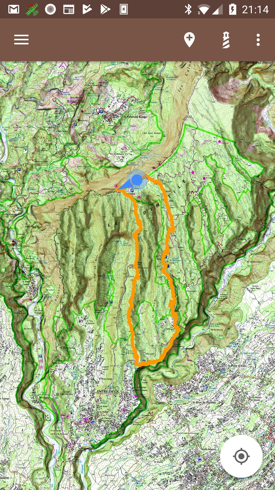

### Importar una ruta GPX

Hay dos formas diferentes de importar una **ruta** gpx. Usando la primera, importa una **ruta** para un
mapa específico, mientras que usando la segunda importa una **ruta** para todos los mapas que pueden mostrar la **ruta**.

#### Importar gpx para un mapa específico

Mientras visualiza un mapa, presione el botón de menú en la esquina superior derecha, luego seleccione "Administrar **rutas**".
Aterrizará en la pantalla de administración de **rutas**. Desde allí, presione el botón de menú en la esquina superior derecha,
luego seleccione "Importar archivo GPX".

#### Importar gpx para todos los mapas

Desde el menú principal > Mis senderos, haga clic en el botón principal en la parte inferior derecha de la pantalla, luego
seleccione "Importar archivos GPX".

Luego puede seleccionar el o los archivo(s) que desea importar. La(s) **ruta(s)** se importarán para todos los mapas
que puedan mostrar la(s) **ruta(s)**.

### Grabación GPX

Es posible registrar su posición y crear un archivo GPX, para luego importarlo a un mapa o compartirlo
con otras personas.

Dentro de cualquier mapa, hay un botón en la esquina superior izquierda:

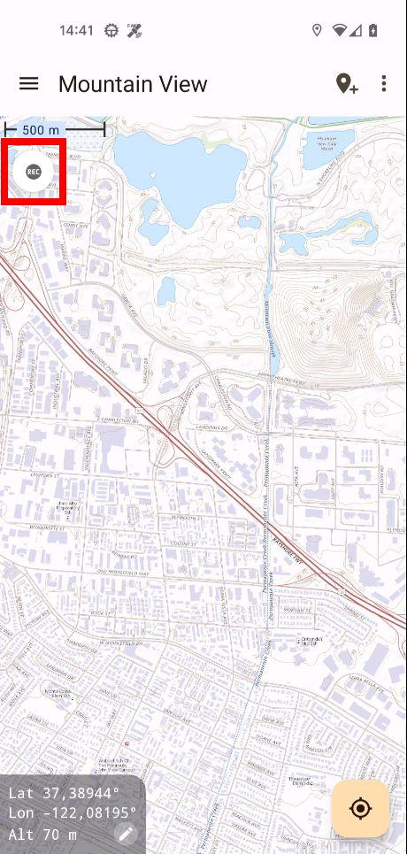

La grabación se puede iniciar, detener o pausar. Al grabar, el servicio de **ubicación**
se ejecuta en segundo plano. Continúa ejecutándose incluso si TrekMe se detiene, hasta que usted decida detenerlo.
Si tiene Android 10 o superior, debe:

- asegurarse de que el permiso de **ubicación** para TrekMe esté configurado en "Permitir todo el tiempo", y no solo cuando se usa la aplicación.
- asegurarse de que la optimización de la batería esté deshabilitada para TrekMe

De lo contrario, algunos puntos no se registrarán y aparecerán líneas rectas en la **ruta**.

### Seguir una ruta

A veces, queremos usar el teléfono lo menos posible. Sin embargo, corremos el riesgo de tomar un camino equivocado y darnos cuenta demasiado tarde.

Para evitar este problema, la función de seguimiento de **rutas** le avisa cuando se sale de la **ruta**. El umbral de alerta es de 50 m por defecto, pero se puede cambiar en la configuración. Esta función solo está disponible con ofertas premium.

El seguimiento de **rutas** se puede iniciar desde cualquier mapa, en el menú superior derecho:

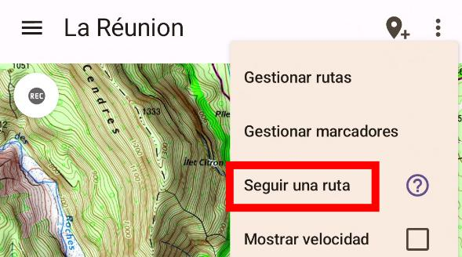

Luego, seleccione la **ruta** a seguir presionando sobre ella en el mapa. La **ruta** seleccionada se resaltará
con un trazo negro fino:

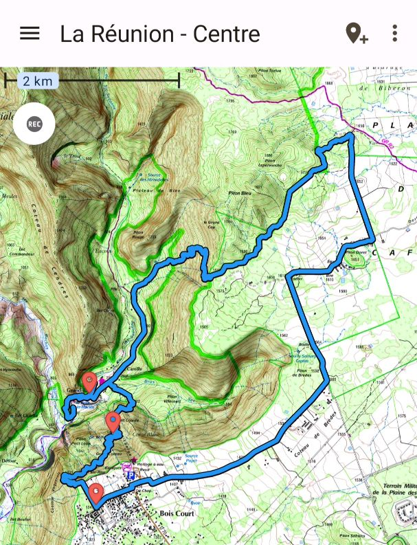

La función de seguimiento de **rutas** se ejecuta como un servicio en segundo plano, que solo funciona cuando se cumplen todas las condiciones siguientes:
- La optimización de la batería está deshabilitada para TrekMe
- La autorización de **ubicación** está configurada en "Permitir todo el tiempo"
- La **ubicación** está habilitada en el dispositivo

---

## Configuración

Se puede acceder a la configuración desde el menú principal > Configuración.

### Iniciar en el último mapa

Por defecto, TrekMe comienza en la lista de mapas. Pero es posible comenzar en el último mapa visto.
En la sección "General" > "Iniciar TrekMe en"

### Carpeta de descarga

Por defecto, TrekMe almacena todo en la memoria interna. Pero si tiene una tarjeta SD, **y** si está montada como dispositivo portátil, puede usarla para almacenar algunos de sus mapas.

**ADVERTENCIA**

Todos sus mapas en la tarjeta SD se eliminarán si se desinstala TrekMe (Android lo exige).
Esta es la razón por la que se recomienda encarecidamente guardar los mapas que no querría perder.
Para obtener más información sobre esto, vaya a la sección "Guardar sus mapas".

En la sección "Carpeta raíz" > "Carpeta seleccionada", puede elegir entre dos directorios si tiene una tarjeta SD. De lo contrario, solo puede usar la memoria interna:

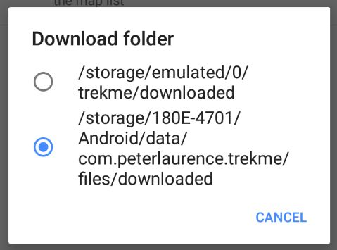

El primer directorio siempre corresponde a la memoria interna. El segundo, si está disponible, corresponde a un directorio en la tarjeta SD. Este directorio es `Android/data/com.peterlaurence.trekme/downloaded`.

Una vez que se cambia la carpeta de descarga, su próxima descarga de mapa la utilizará. Pero los mapas existentes no se mueven.

### Modo de rotación

Hay tres modos de rotación disponibles:

* Sin rotación (por defecto)
* Rotar solo al mostrar la orientación
* Rotación libre

*Rotar solo al mostrar la orientación*

En este modo, el mapa se rota junto con la orientación de su dispositivo *si* habilita la visualización de orientación (mientras visualiza un mapa, en el menú superior derecho > Mostrar orientación).
Cuando la visualización de orientación está habilitada, aparece una pequeña brújula en la parte inferior derecha de la pantalla: el lado rojo indica el Norte. Cuando lo desee, puede deshabilitar la visualización de orientación. En este caso, el mapa se alinea al Norte y la brújula desaparece. También tenga en cuenta que en este modo, presionar la brújula no tiene efecto. Un ejemplo:

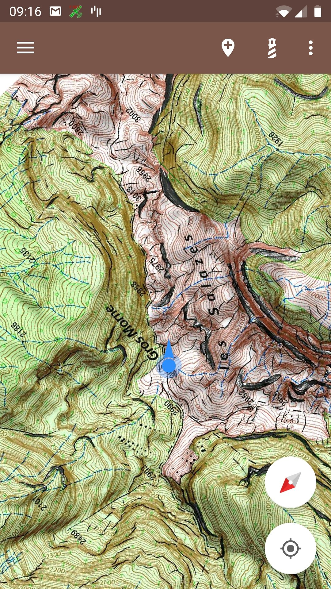

*Rotación libre*

En este modo, puede rotar el mapa a voluntad. La brújula siempre se muestra, y presionarla alinea el mapa al Norte. También puede habilitar o deshabilitar la visualización de orientación; no tendrá consecuencias en la orientación del mapa.

---

### Guardar sus mapas

A partir de Android 10, todos los mapas (no importa si están en la memoria interna o en la tarjeta SD) se
eliminan cuando se desinstala TrekMe. En consecuencia, se recomienda encarecidamente utilizar la función de copia de seguridad de TrekMe. Podrá restaurar sus mapas si, por ejemplo, cambia a un nuevo dispositivo.

Para crear un archivo, vaya a la lista de mapas y muestre las opciones del mapa con una pulsación larga en un mapa o usando el menú superior derecho > mostrar opciones del mapa.

En las opciones del mapa, encontrará un botón "Guardar". Luego, un diálogo explica que está a punto de elegir la carpeta en la que se creará el archivo. Puede elegir la carpeta que desee (o crear una nueva), pero no seleccione un subdirectorio de TrekMe. Si continúa, el archivo se creará en segundo plano; puede ver la progresión en el área de notificación del dispositivo.

Un archivo contiene todo lo relacionado con el mapa (calibración, **rutas**, puntos de interés, etc.).

Una vez archivado, un mapa se puede restaurar utilizando la función de importación.

### Compartir mapa

Un mapa a veces es pesado y la descarga lleva bastante tiempo. Cuando un amigo también tiene TrekMe, es
posible enviarle uno de sus mapas. Esta función requiere que el Wifi esté habilitado en los dos dispositivos,
incluso si no hay un enrutador o punto de acceso en las cercanías; el remitente puede enviar directamente al dispositivo receptor a través de Wifi. Asegúrese de que los dos dispositivos permanezcan relativamente cerca uno del otro. Aunque algunas cargas se han completado con éxito con varios metros entre los dos dispositivos, la experiencia ha demostrado que mantener los dos dispositivos cerca uno del otro reduce el riesgo de error.

Vaya al menú principal > "Recibir y enviar". Hay un botón para recibir y otro para enviar.
Cuando elige recibir, el dispositivo está esperando una conexión con el remitente. Este paso puede
llevar varios minutos; tenga paciencia. Mientras tanto, el remitente usa el botón de enviar y el mapa a enviar.

Cuando se establece la conexión, comienza la carga y puede ver la progresión. Si todo va
bien, se muestra un emoticono magnífico. De lo contrario, y especialmente si la carga se interrumpió, se le aconseja
que comience de nuevo (el Wifi no es 100% fiable).

Si realmente tarda demasiado en establecerse una conexión (más de 5 minutos), intente reiniciar
la recepción y el envío en ambos teléfonos. Como último recurso, reinicie los dos dispositivos y vuelva a intentar el
procedimiento.