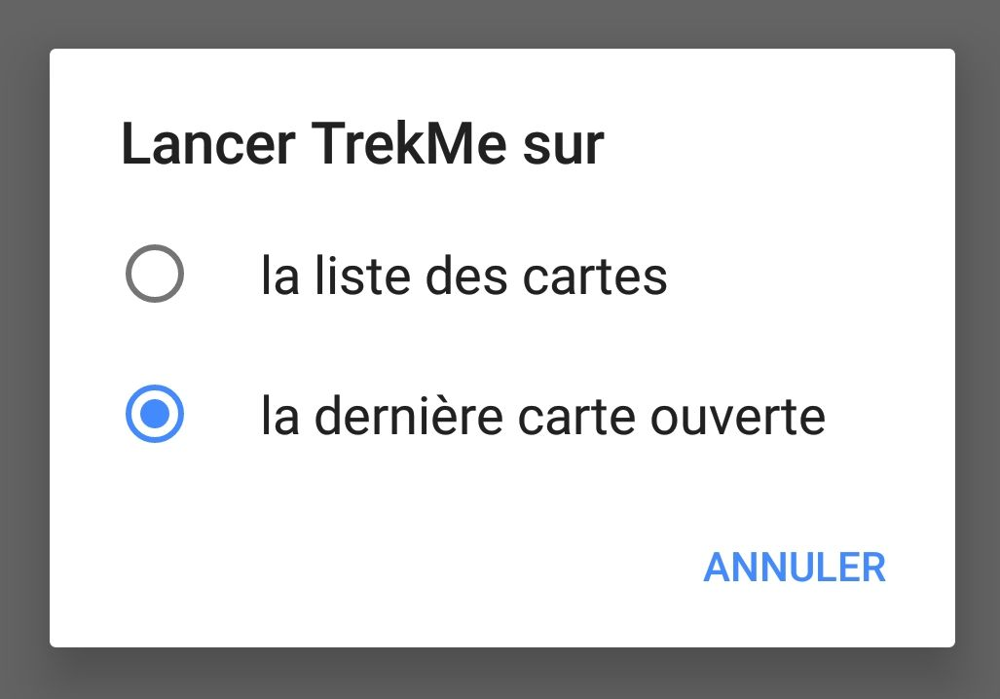
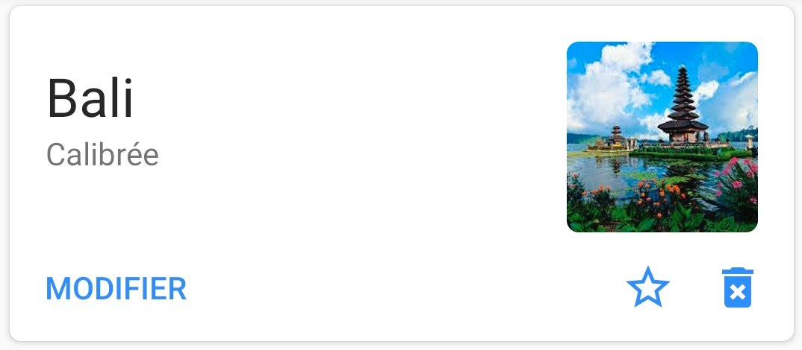

1. [Introduction](#TOC-Overview)
2. [Cartes IGN](#TOC-IGN-maps)
3. [Résumé des fonctionnalités](#TOC-Features-sum)
4. [Créer une carte](#TOC-Create-a-map)
  * [Sélectionner une zone](#TOC-Select-area)
  * [Depuis une archive](#TOC-Import-from-archive)
  * [Recevoir une carte](#TOC-Share-maps)
  * [Création manuelle](#TOC-The-hard-way)
5. [Fonctionnalités](#TOC-Features)
  * [Mesurer une distance](#TOC-Measure-distance)
  * [Afficher la vitesse](#TOC-Show-speed)
  * [Ajouter un marqueur](#TOC-Add-markers)
  * [Ajouter un repère](#TOC-Add-landmarks)
  * [Verrouiller la vue sur la position courante](#TOC-Lock-view)
  * [Visualiser un enregistrement en temps réel](#TOC-Display-live-route)
  * [Importer une trace GPX](#TOC-GPX-track-import)
  * [S'enregistrer au format GPX](#TOC-GPX-recording)
6. [Paramètres](#TOC-Settings)
  * [Démarrer sur la dernière carte](#TOC-Start-on-last-map)
  * [Dossier de téléchargement](#TOC-Download-dir)
  * [Mode de rotation](#TOC-Rotation-mode)
7. [Sauvegardez vos cartes](#TOC-Save-maps)
8. [Partage de carte](#TOC-Share-maps)
9. [Que faire si...](doc/troubleshoot/troubleshoot.fr.md)

## Introduction

TrekMe est une application Android permettant de se localiser sur une carte topographique, sans 
nécessiter de connexion internet (sauf chez soi au moment de créer la carte). La différence principale
 avec les autres applications de la même catégorie est la source des cartes. Il est possible de 
 télécharger des cartes IGN, USGS, et OpenStreetMap (d'autres sources seront ajoutées). Mais il est 
 aussi possible d'utiliser votre propre carte si vous la scannez et suivez le tutoriel pour l'utiliser
  avec TrekMe.
L'accent a été mis sur la faible consommation des ressources, pour maximiser l'autonomie lors d'une 
randonnée.

## Cartes IGN

TrekMe vous propose un abonnement annuel. Pourquoi n'est-ce pas gratuit? L'esprit de TrekMe est la 
consultation hors ligne des cartes. Or, le stockage des cartes IGN n'est autorisé que dans le cadre 
d'une [licence d'exploitation grand public numérique](http://professionnels.ign.fr/doc/bareme_LCO_2019.pdf). 
Cette licence est payante. L'application vous invitera donc à la régler quand vous voudrez créer 
votre première carte IGN. Vous êtes alors parti pour un an.

## Résumé des fonctionnalités

* Création de cartes depuis l'application:
    - France IGN (requiert une souscription **annuelle** à l'IGN)
    - Swiss Topo
	- USA : USGS
 	- Espagne IGN 
 	- OpenStreetMap
* Marqueurs (possibilité d'ajout de commentaire)
* GPX : import de trace et enregistrement
* Indicateur d'orientation
* Indicateur de vitesse
* Indicateur de distance à vol d'oiseau
* Verrouiller la vue à la position courante

## Créer une carte

Il y a quatre manières de créer une carte :
1. Sélectionner une zone avec une source de carte comme l'IGN par ex
2. Import d'une archive
3. Recevoir une carte d'un autre utilisateur de TrekMe (à proximité, en Wifi)
4. La faire soi-même (pour les utilisateurs avancés)

La méthode la plus facile et recommandée est la première. Ci-dessous sont décrites ces trois méthodes.

### Sélectionner une zone

Ici, on utilise une source de carte spécifique. Google map est un exemple de source très connu. Mais
 leurs cartes ne sont pas idéales pour la randonnée (on souhaite avoir des cartes plus adaptées).

Les cartes IGN sont parfaites pour cela. Elles couvrent la France entière ainsi que les DOM-TOM 
(Guadeloupe, Martinique, Réunion, Tahiti, etc.). Pour les Etats-Unis, il y a l'USGS.
Il est important de noter que tous les pays n'ont pas un service national équivalent de l'IGN. Donc 
parfois, il faut se contenter des cartes OpenStreetMap.

Certains fournisseurs de carte nécessitent une souscription, pour l'instant seulement l'IGN.

Depuis le menu principal, choisissez "Créer une carte". Un menu vous donne alors le choix entre les 
sources suivantes : 

Vous pouvez librement visionner les cartes d'IGN France. Mais pour sauvegarder des cartes IGN France,
 l'abonnement annuel est nécessaire.

Vous pouvez alors zoomer et vous déplacer sur la zone qui vous intérresse. Un bouton en haut à droite, 
ressemblant à un carré, vous permet de faire apparaître une zone modifiable (en bleu).
Quand vous êtes satisfait de votre sélection, utilisez le bouton de téléchargement en bas à droite.

NB : la plupart des fournisseurs de cartes n'ont qu'une couverture partielle du globe. A l'exception 
d'OpenStreetMap, qui couvre le monde entier, l'USGS par ex ne couvre que les Etats-Unis, l'IGN Espagne 
que l'Espagne, etc.

Un menu tel que celui-ci s'affiche :

Les fournisseurs de carte proposent différents niveaux de zoom, allant de 1 (niveau globe)  à 18 
(carte très détaillée).
Dans la plupart des cas, vous ne voulez pas des niveaux 1 à 10, et le niveau 18 n'est pas nécessaire. 
C'est la raison pour laquelle le réglage par défaut est de 12 pour le zoom minimum, et 16 pour le maximum.

La quantité d'images qui devront être téléchargées dépend directement du choix des niveaux de zoom 
min et max. Plus le niveau de zoom min est petit et plus le niveau max est grand, plus la quantité à
 télécharger est importante.
Ceci est indiqué par les nombre de transactions. Mais aussi plus simplement l'estimation de la taille
 de la carte en Mo est indiquée.
Il est important de noter que télécharger plusieurs centaines de Mo peut prendre des heures... Il est
 donc fortement recommandé de ne sélectionner que la zone dont vous avez besoin.

Quand tout est ok, utilisez le bouton "Telecharger". Un service est alors lancé, et une notification 
vous en informe. Depuis le gestionnaire de notifications de votre téléphone, vous pouvez :

* Voir la progressoin du téléchargement
* Annuler le téléchargement

Quand le service a fini le téléchargement, vous recevez une notification et une nouvelle carte est 
disponible dans la liste des cartes. Cette carte est déjà calibrée et prête à l'emploi.
Vous pouvez la personnaliser en lui associant une image de présentation qui apparaîtra à côté de son
 nom dans la liste des cartes. Pour ce faire, utilisez le bouton d'édition en dessous du nom de la 
 carte, sur la gauche.
Vous accédez alors à la configuration de la carte, où vous pouvez :

* Changer l'image de présentation
* Changer la projection de la carte (seulement si vous savez ce que vous faites)
* Changer les points de calibration (seulement si vous savez ce que vous faites)
* Changer le nom de la carte
* Supprimer la carte

### Depuis une archive

Une carte peut aussi être créée en important une archive d'une carte existante. L'archive peut avoir 
été faite par vous même ou quelqu'un d'autre (voir plus bas pour créer une archive). Elle se présente
 sous la 
forme d'un fichier zip.
Pour importer une archive, utilisez le menu principal puis "Importer une carte". Appuyez alors sur le
bouton "Importer depuis un dossier", au milieu de l'écran. Naviguez alors vers le dossier qui contient
la ou les archives et sélectionnez-le. TrekMe liste alors les archives reconnues, que vous pouvez 
importer individuellement.

### Recevoir une carte

Reportez-vous à la section [Partage de carte](#TOC-Share-maps).

### Création manuelle - le plus difficile

C'est réservé aux experts. Cette méthode n'est en aucun cas nécessaire, mais grâce à cette fonctionnalité, 
on peut mettre n'importe quelle carte dans TrekMe.
Il faut avoir des connaissances en géolocalisation, et il est recommandé d'être familiarisé avec les
 termes suivants :

[Map projection](https://en.wikipedia.org/wiki/Map_projection),
[WGS84](https://en.wikipedia.org/wiki/World_Geodetic_System#WGS84),
[Mercator](https://en.wikipedia.org/wiki/Mercator_projection?oldid=9506890).

Pour les personnes voulant apprendre, il est conseillé de lire ce [guide](UserGuide.md) (en anglais).

Ensuite, poursuivez avec le [Guide de création manuelle de carte](MapCreation-Manual.md).

   
## Fonctionnalités

### Mesurer une distance

Il y deux manières de mesurer une distance dans TrekMe :

*Distance à vol d'oiseau*

C'est une option en haut à droite alors qu'une carte est affichée: "Mesurer une distance".
Ajuster la mesure en déplaçant les deux ronds bleus.

*Distance le long d'une trace*

Quand on fait une randonnée en suivant une trace, il est parfois utile de connaître la distance entre
deux points le long de la trace. Cela permet par exemple de connaître la distance restante avec un 
point particulier, et évaluer si on a assez de temps pour faire l'aller-retour.

Il s'agit d'un mode à activer/désactiver dans les options d'une carte: "Distance sur trace".
Lorsque activée, deux rond bleus appraissent sur la trace la plus proche du centre de l'écran. La
portion de la trace entre les deux ronds est en rouge et sa longueur est indiquée:

La distance affichée tient compte du dénivellé *si* la trace contient l'information d'altitude pour
chacun des points.

### Afficher la vitesse

C'est une option en haut à droite alors qu'une carte est affichée.
La vitesse s'affiche en km/h au bout de quelques secondes.

Selon la taille de votre écran, un bouton peut rendre cette fonctionnalité directement accessible.

### Ajout de marqueurs

Utilisez le bouton d'ajout de marqueur, ce qui affiche un nouveau marqueur au centre de l'écran, 
comme celui-ci :

Avec ses flèches rouge qui tournent autour, il indique qu'il peut être déplacé. Pour cela appuyez 
avec un doigt dans la zone bleue et déplacez le marqueur à l'endroit désiré.
Quand vous êtes satisfait de sa position, "appuyez" une fois sur le marqueur rouge. Il change alors 
de forme et la zone bleue disparaît. Cela indique que le marqueur est désormais fixé à son emplacement.

Si on appuie sur le marqueur, une bulle comme celle-ci s'affiche :

On peut alors :

* Changer le nom ou le commentaire du marqueur 
* Supprimer le marqueur
* Déplacer le marqueur (il reprend sa forme avec les flèches qui tournent, indiquant qu'il peut être 
déplacé)

Voici un exemple de fiche d'un marqueur :

La plupart du temps, on se contente de modifier seulement le nom ou le commentaire.
Rien n'est modifié tant que vous ne sauvegardez pas vos modifications (bouton "disquette" en haut).

### Ajout de points de repère

Un point de repère est un marqueur spécial. Une ligne de couleur violette se dessine entre votre 
position actuelle et le repère. De cette manière vous pouvez vous fixer un objectif éloigné et 
toujours voir à l'écran la direction vers ce repère.

Pour ajouter un point de repère, c'est le même principe que pour les marqueurs mais on utilise 
l'icone de phare (comme un amer en navigation maritime).

En général, on affiche en même temps l'orientation. On peut aussi en ajouter plusieurs :

### Verrouiller la vue sur la position courante

Parfois, on veut que la vue reste centrée sur notre position (on ne veut pas que le point bleu sorte 
de l'écran). Pour cela, il faut activer le verrouillage sur la position. Utilisez alors le menu 
comme ci-dessous :

Puis sélectionnez "Verrouiller sur la position". Dans ce mode, à chaque fois que l'application reçoit
 votre position (environ toutes les secondes), la vue se déplace et le point bleu reste au centre.

### Visualiser un enregistrement en temps réel

Par défaut, lorsque vous lancez un enregistrement GPX (depuis le menu "Enregistrement du parcours"), 
l'enregistrement en cours s'affiche sur votre carte, sous forme de trace jaune.
Cela ne fonctionne que pour les cartes qui couvrent la zone dans laquelle vous êtes au moment de 
l'enregistrement.

Même si vous quittez TrekMe, vous retrouverez la trace en temps réel sur votre carte, tant que l'enregistrement est en cours.

### Import d'un fichier GPX

Alors que vous visionnez une carte, utilisez le bouton suivant :

La liste des traces disponibles pour votre carte s'affiche alors (il est possible à ce stade qu'il y 
en ait aucune) :

Vous pouvez alors :

* Importer un fichier gpx avec le bouton d'import en haut
* Gérer la visibilité des traces déjà importées
* Supprimer des traces en les faisant glisser à droite ou à gauche (cela n'affecte en rien le fichier gpx)

### Enregistrement GPX

Il est possible d'enregistrer votre parcours au format GPX, pour ensuite l'importer dans une carte 
ou le partager.

Depuis le menu principal allez à "Enregistrement du parcours". Vous arrivez à une interface comme
 celle-ci :

Un enregistrement peut être démarré ou arrêté depuis le panneau "Commandes".
Quand un enregistrement est en cours, un service spécifique est démarré, qui fonctionne même si TrekMe 
est arrêté. Ce service s'arrête dès que vous l'arrêtez depuis le panneau "Commandes".

Un indicateur dans le panneau "Service de localisation" affiche le statut du service.

Un dernier panneau affiche la liste des enregistrements effectués.
En sélectionnant un enregistrement, trois boutons en bas à gauche vous permettent respectivement de :

* renommer le fichier gpx
* l'importer dans une carte existante (un menu vous donne alors le choix de la carte)
* partager un ou plusieurs fichiers gpx

**Mode de sélection multiple**

Appuyez deux secondes sur un enregistrement. 
Pour revenir au mode de sélection normal, appuyez à nouveau deux secondes sur un enregistrement.

**Partage d'un ou plusieurs enregistrements**

Que vous soyez en mode de sélection simple ou multiple, le bouton de partage est disponible :

**Supprimer un enregistrement**

Passez en mode de sélection multiple. Un bouton rouge en bas à droite apparaît. Attention, si vous 
pressez ce bouton rouge, tous les enregistrement sélectionnés (cad sur fond bleu) seront **définitivement**
  supprimés. 

## Paramètres

Les paramètres de TrekMe sont accessibles depuis le menu principal > Paramètres.

### Démarrer sur la dernière carte

Par défaut, TrekMe démarre sur la liste des cartes. Mais vous pouvez aussi démarrer sur la dernière 
carte visitée. Dans la section "Général" > "Lancer TrekMe sur" :

### Dossier de téléchargement

Par défaut, TrekMe enregistre tout sur la mémoire interne. Mais si vous avez une carte SD, **et** que
 celle-ci est montée en tant que **stockage amovible**, alors vous pouvez l'utiliser pour stocker 
 certaines de vos cartes.

**Attention**

Toutes les cartes stockées sur carte SD seront supprimées si TrekMe est désinstallée (c'est une 
contrainte du système Android). La seule manière de conserver de manière sûre vos cartes est d'utiliser
 la mémoire interne.
 
Cependant, vous pouvez contourner cette limitation : faites une sauvegarde, puis déplacez l'archive 
zip créée quelque part sur votre carte SD (dans un autre dossier que le dossier Android).

Dans la section Téléchargment > "Répertoire de téléchargement", vous avez le choix entre deux répertoires
 si vous avez une carte SD. Sinon, vous n'avez d'autre choix que d'utiliser la mémoire interne.

Le premier répertoire correspond toujours à la mémoire interne. Le second, s'il y en a un, à la carte 
SD. Ce dossier est `Android/data/com.peterlaurence.trekme/downloaded`.

Une fois le répertoire modifié, votre prochain téléchargement de carte utilisera ce dossier. Mais 
les cartes existantes ne sont pas déplacées.

### Mode de rotation

Vous pouvez sélectionner parmi trois mode de rotation:

* Aucune rotation (mode par défaut)
* Tourner la carte selon l'orientation
* Rotation libre

*Tourner la carte selon l'orientation*

Dans ce mode, la carte s'oriente en fonction d'orientation de votre appareil *si* vous activez l'affichage de
l'orientation (lors du visionnage d'une carte, menu en haut à droite > Afficher l'orientation).
Lorsque l'orientation est activée, apparaît également en bas à droite une petite boussole, dont
l'aiguille rouge indique le Nord. Vous pouvez à tout moment choisir de désactiver temporairement la 
rotation de la carte en désactivant l'affichage de l'orientation. Dans ce cas, la carte s'aligne sur
le Nord et la boussole disparaît. A noter que dans ce mode, appuyer sur la boussole n'a aucun effet.
Par exemple:

*Rotation libre*

Dans ce mode, vous pouvez tourner la carte à volonté. La boussole s'affiche toujours, et appuyer dessus
aligne la carte sur le Nord. Vous pouvez aussi afficher ou masquer l'orientation, sans conséquence sur
l'alignement de la carte.

### Sauvegardez vos cartes

A partir d'Android 10, toutes les cartes (qu'elles soient sur mémoire interne ou carte SD) sont supprimées
si TrekMe est désinstallé. Il vous est donc fortement conseillé d'utiliser la fonctionnalité de sauvegarde
intégrée à TrekMe. Cela vous permettra de restaurer vos cartes si vous changez de téléphone par exemple.

Pour créer une archive, depuis la liste des cartes, utilisez le bouton "GERER", en bas à gauche :

Vous arrivez alors dans les options pour cette carte. Tout en bas, il y a un bouton "Sauvegarder".
Appuyez dessus ; un message vous explique alors que vous devez choisir le dossier dans votre téléphone
où l'archive sera créée. Vous pouvez en effet choisir le dossier que vous voulez (ne choisissez pas
un dossier interne à l'application TrekMe..).
Si vous continuez la procédure, l'archive va être créée et vous pouvez suivre la progression dans la
zone de notification du téléphone.

Une archive contient tout ce qui est relatif à la carte (calibration, traces, points d'intérêt, etc).

### Partage de carte

Une carte est parfois volumineuse et longue à télécharger. Quand un(e) ami(e) a aussi TrekMe, vous
pouvez lui envoyer directement une de vos cartes. Cela fonctionne avec la Wifi, sans nécessité d'être
à proximité d'une box ou un hotspot : la communication se fait directement avec l'autre appareil (qui
lui aussi doit activer sa Wifi). Veillez donc bien à activer la Wifi pour la suite, et faites en sorte 
que les deux appareils soient relativement proches (même si des transferts ont réussi avec plusieurs
mètres de distance, l'expérience montre que plus ils sont proches, moins il y a de risque d'erreur).

Rendez-vous dans le menu principal > "Recevoir et envoyer". L'interface propose un bouton pour
recevoir une carte, et un autre pour envoyer. Lorsque vous choisissez de recevoir, l'interface indique
qu'elle est en attente de réception. Les deux appareils cherchent à établir un canal de communication.
Cette phase peut durer plusieurs minutes ; il faut être patient(e).
Pendant ce temps, votre ami(e) utilise le bouton d'envoi, et choisit alors la carte à envoyer.

Quand la connexion est établie, le transfert commence et vous pouvez voir la progression en temps réel.
Si tout se passe bien, le transfert va jusqu'au bout et une magnifique emoticon vous l'indique. Dans
le cas contraire, et en particulier si le transfert s'est interrompu en cours de chargement, une nouvelle
tentative peut réussir (ce sont les aléas de la Wifi).

Si les deux appareils mettent vraiment trop de temps à se connecter et à débuter le transfert, essayez 
de redémarrer les deux apprareils puis re-tentez la procédure.
