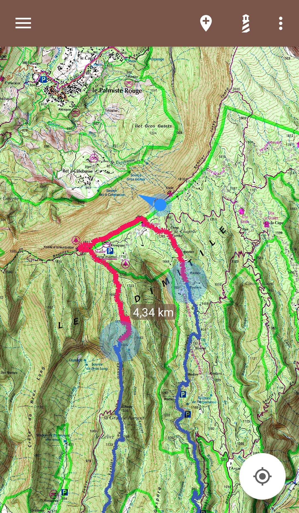
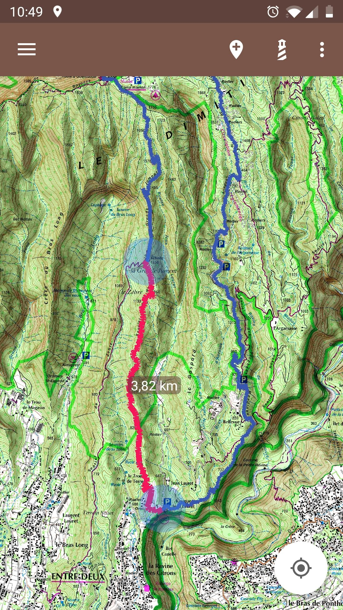
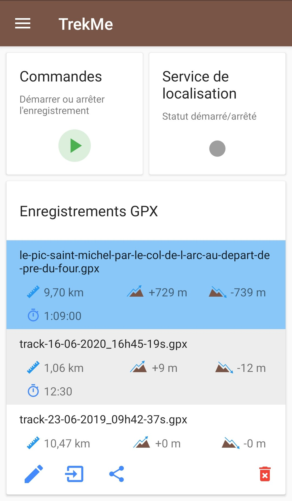
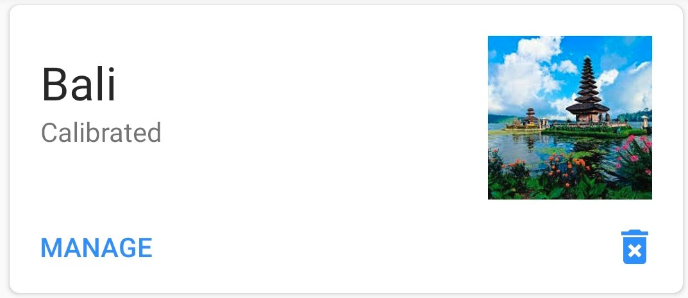

 &nbsp&nbsp&nbsp 

## Summary

1. [Overview](#TOC-Overview)
2. [Features summary](#TOC-Features-sum)
3. [Create a map](#TOC-Create-a-map)
  * [Select an area](#TOC-Select-area)
  * [From an archive](#TOC-Import-from-archive)
  * [Receive a map](#TOC-Share-maps)
  * [Manual map creation](#TOC-The-hard-way)
4. [Features](#TOC-Features)
  * [Measure a distance](#TOC-Measure-distance)
  * [Show the speed](#TOC-Show-speed)
  * [Add markers](#TOC-Add-markers)
  * [Add a landmark](#TOC-Add-landmarks)
  * [Lock the view on current position](#TOC-Lock-view)
  * [Visualize a recording in real time](#TOC-Display-live-route)
  * [Import a GPX track](#TOC-GPX-track-import)
  * [GPX recording](#TOC-GPX-recording)
5. [Settings](#TOC-Settings)
  * [Start on the last map](#TOC-Start-on-last-map)
  * [Download folder](#TOC-Download-dir)
  * [Rotation mode](#TOC-Rotation-mode)
6. [Save your maps](#TOC-Save-maps)
7. [Share your maps](#TOC-Share-maps)

## Overview

TrekMe is an Android trekking app to get live position on a map and other useful information, without
ever needing an internet connection (except when creating a map).
TrekMe is designed to work with any WMTS source such as USGS in USA, IGN France, Swiss topo, 
OpenStreetMap and so on. 
You can download an area of your choice so the cached tiles are available for offline usage.

Perhaps most importantly, TrekMe is _designed_ to consume few CPU resources, to preserve the device's battery. 

## Features summary

* Support in-app map creation from:
	- United States's USGS
	- France IGN (requires an **annual subscription**)
 	- Spain IGN 
 	- Swiss Topo
 	- OpenStreetMap
* Marker support (with optional comments)
* GPX tracks import
* Lock the view to the current position
* Orientation indicator
* Speed indicator
* Distance indicator
* GPX track recording

## Create a map

There are four ways to create a map:

1. Select an area from an official source provider like IGN or USGS,
2. Import from an archive,
3. Receive a map from a nearby TrekMe user (over Wifi),
4. Make it yourself (the hard way)

The preferred and easiest way is the first one. Below are detailed each of these methods.

### Select an area

In this mode, you use a specific map provider. Google map is a well known example of map provider. 
But their maps aren't ideal for hiking. When possible, it is better to use maps with more terrain
details. 

For example, France's IGN is ideal when you are in France and its territories (Guadeloupe, Martinique,
Réunion, Tahiti, etc.). There is also USGS for the USA. But not all countries have similar service, 
so sometimes you will have to fallback to OpenStreetMap or Google map.

Some providers require you to subscribe to download their maps. This step is free for individuals, 
unless you have specific needs like heavy loads for your organization.

From the "Create map" option menu, you get to choose between available providers:

When you've made your choice, the map appears shortly.

From there, you can zoom into the area in the world you want to capture. Then, press the area button
in the top-bar (which looks like a square) so an area of selection appears. This area can be resized
 by moving the two blue rounds. 
 
 Beware that USGS only provides detailed levels for USA. Actually, other providers only cover their 
 relevant country, except for OpenStreetMap which covers the entire world.

When you're done, press the download button, at the bottom right. Except for France's IGN, for which
 an annual subscription is required, you'll see this configuration menu:

WMTS map providers have different zoom levels, generally from 1 to 18. In most cases, you don't want
levels 1 to 10 for your hike, and level 18 is not always necessary. This is why the default presets
have the minimum and maximum levels to 12 and 17 respectively. 

The number of tiles that will be downloaded depends on your choice of minimum and maximum levels.
The lower the minimum zoom, and the higher the maximum zoom, the greater is number of tiles. This
is indicated by the "number of transactions". Downloading thousands of transactions may take hours..
so choose carefully your area and levels to only download the tiles you actually need.

Finally, press the download button. A download service is launched and you get a notification. From
the notification center of your Android device, you can either:

* See the download progression,
* Cancel the download

When the service finishes the download, you get a notification and a new map is available in the map
list. It is already calibrated and ready to be used. You can set a presentation image so you can
easily identify it in the map list. To do so, press the edit button at the bottom left of the map
card (in the map list menu). 

From the map configuration view, you can:

* Change the thumbnail image,
* Change the projection (only if you know what you're doing),
* Change the calibration points (only if you know what you're doing),
* Change the name,
* Save the map

### Import from an archive

A map can also be created from an existing archive. The archive can be made by yourself or someone 
else (see below to create an archive). An archive is a zip file.
To import from an archive, use the main menu and choose "Import a map". Then, press the button 
"Import from folder" in the middle of the screen. Navigate to the folder which contains the archive(s)
and select that folder. Then, TrekMe shows you the recognized archives, which you can individually
import.

### Receive a map

See [Map Sharing](#TOC-Share-maps).

### Manual map creation - the hard way

If you own a paper map, just scan it, then prepare it to use inside TrekMe (see below). It also works
 if you have a huge single image (several Gb), as TrekMe is designed to work with arbitrary map size.
The only limitation is the memory available on your device (smartphone, tablet).

However, it's definitely not easy to create a map using this method, as basic understanding of 
localisation on a map is required. If you can, prefer the first method (area selection).

It is advised to be familiar with the following terms:
[Map projection](https://en.wikipedia.org/wiki/Map_projection),
[WGS84](https://en.wikipedia.org/wiki/World_Geodetic_System#WGS84),
[Mercator](https://en.wikipedia.org/wiki/Mercator_projection?oldid=9506890).

Beginners are strongly advised to read the Technical Basis from the [User Guide](UserGuide.md).

Then, proceed with the [Manual map creation guide](MapCreation-Manual.md).

   
## Features

### Measure a distance

Distance can be measured using two different tools in TrekMe:

*As the crow flies distance*

This is an option from the top-right menu while viewing a map: 
Adjust the distance by dragging two blue circles.

*Along track distance*

While following a track, it's sometimes handy to know the distance between two points on that track. 
For example, you can evaluate whether you have enough time to reach some point, then go around before
 nightfall.

This is an option from the top-right menu while viewing a map: "Distance on track". It can be 
activated/disabled. When enabled, two blue circles appear on the nearest track from the center of the
screen. The portion of the track between the two blue circles is highlighted in red, and its 
distance is shown.

The distance accounts for elevation *only if* the track contains elevation data for each point.

### Show the speed

The speed indicator overlays the speed in km/h at the top of the screen. Note that it requires a few 
seconds before the speed can be displayed.

Then choose "Show the speed". If your screen is large enough, there is an icon to directly access it.

### Add markers

Press the marker button to add a new marker at the center of the screen:

With its reds arrows turning around it, its shows that it can be moved by dragging the blue circle.
When you're satisfied with its position, tap on the red circle at the center. It then morphs to its 
static form.

Tapping a marker displays a popup:

From here you can:

* Edit the marker (change its name and set a comment, see below),
* Delete it,
* Move it

Here is the marker edition view:

Nothing is changed until you save your changes.

### Add landmarks

A landmark is a specific marker. A purple line is drawn between it and your current position. So it helps when you need to always know the direction of a specific place, which may be outside of the area that your screen covers.

To add a landmark, it is the same logic as for markers. But this time we use the lighthouse icon.

Often, we want to display our orientation in the same time. We can also add several landmarks:

### Lock the view on current position

Sometimes, you want the view to automatically follow your position. To do that, use the menu as shown bellow:

Then select "Lock on position". Now, everytime the application gets a location update (approximately every second), the view centers on this new location.

### Visualize a recording in real time

When you start a recording from the "GPX Record" option menu, the recording can be seen in real time on any map that covers your current area.
It appears as a yellow route.

Even if you close TrekMe, you will find your live route the next time you open it, until you stop the recording.

### Import a GPX track

While viewing a map, press the button below on the upper right corner :

Then, a list of currently available tracks opens up: 

Here you can:

* Import a new gpx files using the import button,
* Manage track visibility,
* Remove tracks by swiping them left or right

### GPX recording

It is possible to record your position and create a GPX file, to later import into a map or share
with other people.

From the "GPX Record" option menu, you get the following interface:

The recording can be started or stopped from the control panel. When recording, the location service
runs in the background. It continues even if TrekMe is stopped or paused.
An indicator reports back the status of the location service. A panel shows the list of recordings.

From there, when selecting a track, there are three buttons at the bottom which enable you to :

* rename it,
* import it into an existing map (press the import button at the bottom of the list, then choose the map),
* share it

**Multiple-selection mode**

To switch to multiple-selection mode, long-press a recording.
To revert back to single selection mode, long press again somewhere in the list.

**Share recordings**

Whatever the selection mode, the share button below is available:

**Delete a recording**

To delete a recording, activate the multiple-selection mode. A remove button appears at the bottom right.

**Automatic import of a track**

After you stop a recording, a new GPX file is added to the recordings list _and_ the corresponding
track is automatically imported into all relevant maps.
This way, it's super easy to record yourself and see your tracks on your favorite maps.

## Settings

Settings are accessible from the main menu > Settings.

### Start on the last map

By default, TrekMe starts on the list of maps. But it's possible to start on the last viewed map. In the "General" section > "Start TrekMe on"

### Download folder

By default, TrekMe stores everything on the internal memory. But if you have an SD card, **and** if it's mounted as portable device, you can use it to store some of your maps.

**Beware**

All your maps on the SD card will be deleted if TrekMe is uninstalled (Android enforces that). The only way to safely keep your maps is to store them on the internal memory.
However, as a workaround, you can save a map and move the resulting zip archive to another directory (outside of the Android folder on the SD card).

In the "Download" section > "Download folder", you can chose between to directories if you have an SD card. Otherwise, you don't have the choice but to use the internal memory:

The first directory always corresponds to the internal memory. The second, if available, corresponds to a directory on the SD card. This directory is `Android/data/com.peterlaurence.trekme/downloaded`.

Once the download folder is changed, your next map download will use it. But existing maps aren't moved.

### Rotation mode

Three rotation modes are available:

* No rotation (by default)
* Rotate only when showing orientation
* Free rotation

*Rotate only when showing orientation*

In this mode, the map is rotated along with your device's orientation *if* you enable orientation
display (while displaying a map, in the upper right menu > Show orientation).
When orientation display is enabled, a small compass appears in the bottom right of the screen - the
read side indicates the North. Whenever you like, you can disable orientation display. In this case, 
the map is aligned to the North and the compass disappears. Also note that in this mode, pressing the
compass has no effect. An example:

*Free rotation*

In this mode, you can rotate the map as will. The compass is always displayed, and pressing it aligns
the map to the North. You can also enable or disable orientation display - it won't have consequences 
on the orientation of the map.

### Save your maps

Starting from Android 10, all maps (no matter if they're on the internal memory or SD card) are
deleted when TrekMe is uninstalled. Consequently, it's highly recommended to use the backup feature
of TrekMe. You'll be able to restore your maps if you e.g change for a new device.

To create an archive, go to the list of maps and press the "MANAGE" button at the bottom left:

You land on a bunch of options related to the selected map. The last option is a "Save" button - press
it. A dialog explains that you're about to choose the folder in which the archive will be created.
You can choose whatever folder you want, but don't select a subdirectory of TrekMe. If you continue,
the archive will be created in background - you can see the progression in the notification area of the
device.

An archive contains everything related to the map (calibration, routes, points of interest, etc.).

Just like maps, archives are stored on a dedicated folder which you choose in the settings of the
application. Beware that if you uninstall TrekMe, those folders and their content (including maps
and archives) will be **permanently deleted**. There's an exception though. If you have Android 9 or
lower, the folder on the internal storage won't be removed.

In other cases, the only reliable way to keep your archives safe is to move them to a secure location.
For example, it could be a folder named "TrekMe_backup" somewhere on your SD card or internal
storage. That folder shouldn't be a subfolder of the folder(s) used by TrekMe. 

### Map sharing

A map is sometimes heavy and takes quite some time to download. When a friend also has TrekMe, it's
possible send him/her one of your maps. This feature requires the Wifi to be enabled on the two devices,
even if there is no router or hotspot in the vicinity - the sender directly send to the receiving
device over Wifi. Make sure that the two devices stay relatively close to each other. Even if some
loads have completed successfully with several meters between the two devices, experience has shown 
that keeping the two devices close to each other lowers the risk of error.

Go ahead in the main menu > "Receive and send". There's a button to receive and another one to send.
When you choose to receive, the device is awaiting for a connection with the sender. This step can
take several minutes - please be patient. Meanwhile, the sender uses the send button and the map to send.

When the connexion is established, the load starts and you can see the progression. If everything goes
well, a gorgeous emoticon is shown. Otherwise, and especially if the load got interrupted, you're advised
to start again (Wifi isn't 100% reliable).

If the two devices really take too much time to establish a connection and start the load, try to
reboot the two devices and retry the procedure.

