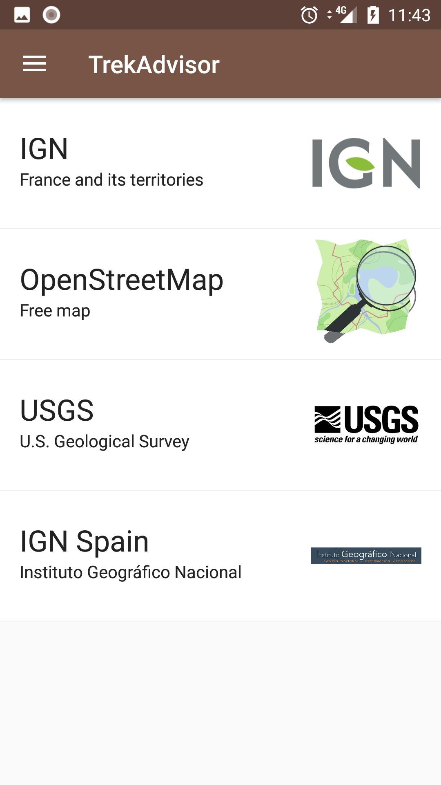
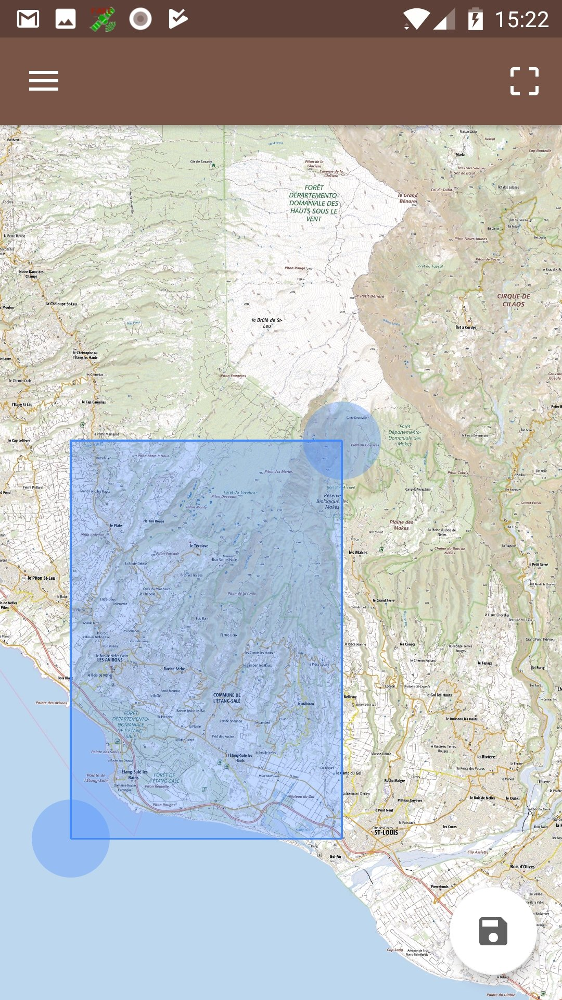
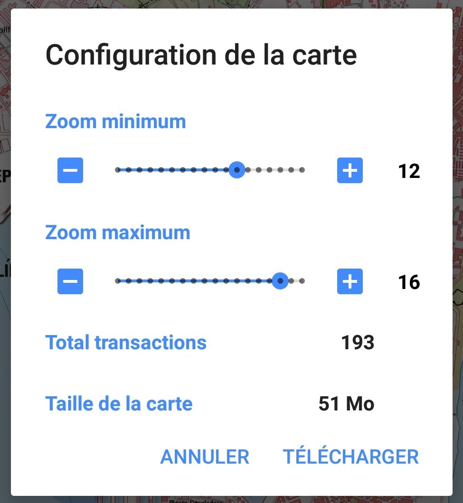
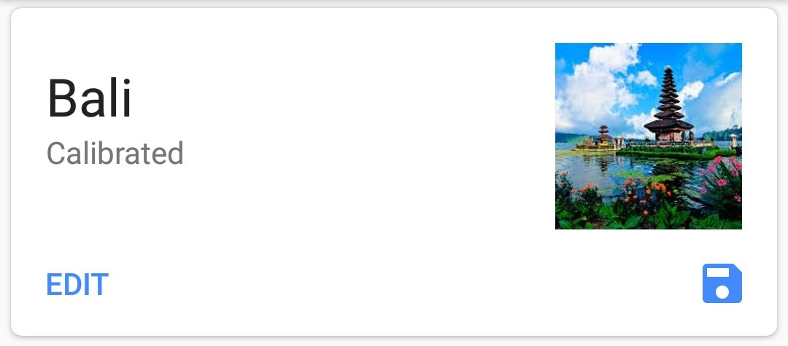
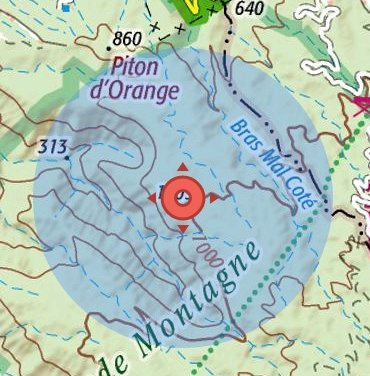
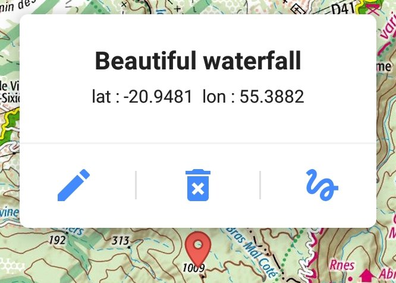
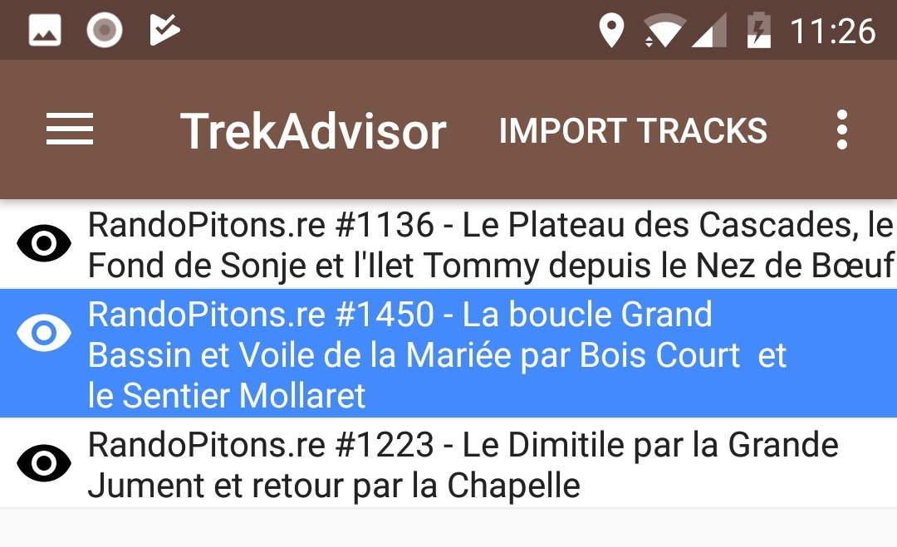
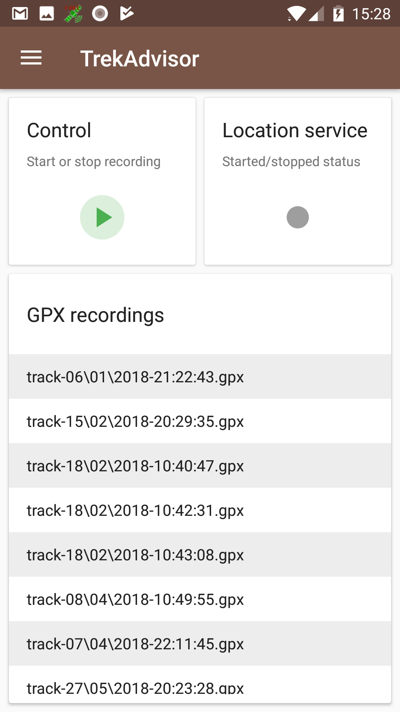
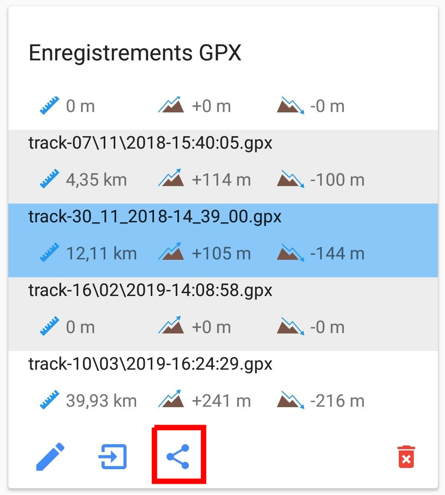

1. [Overview](#TOC-Overview)
2. [Features summary](#TOC-Features-sum)
3. [Create a map](#TOC-Create-a-map)
  * [Select an area](#TOC-Select-area)
  * [From an archive](#TOC-Import-from-archive)
  * [Manual map creation](#TOC-The-hard-way)
4. [Features](#TOC-Features)
  * [Measure a distance](#TOC-Measure-distance)
  * [Show the speed](#TOC-Show-speed)
  * [Add markers](#TOC-Add-markers)
  * [Add a landmark](#TOC-Add-landmarks)
  * [Lock the view on current position](#TOC-Lock-view)
  * [Visualize a recording in real time](#TOC-Display-live-route)
  * [Import a GPX track](#TOC-GPX-track-import)
  * [GPX recording](#TOC-GPX-recording)
5. [Settings](#TOC-Settings)
  * [Start on the last map](#TOC-Start-on-last-map)
  * [Download folder](#TOC-Download-dir)

## Overview

TrekMe is an Android app to get live position on a map and other useful information, without
ever needing an internet connection (except when creating a map).
It differs from other similar apps in the source of maps.
Usually, a map is downloaded from the internet and is sometimes cached for an offline access (e.g google map).
TrekMe is designed for people willing to use particular maps like USGS in USA, or IGN in France for example. In fact, any WMTS source can be integrated inside TrekMe.
But it's not limited to that. If you own a paper map and you want to use it for your next trek, just scan it, then prepare it to use inside TrekMe (see below). It also works if you have a huge single image (several Gb), as TrekMe is designed to work with arbitrary map size.
The only limitation is the memory available on your device (smartphone, tablet).
Finally, TrekMe is designed to consume very few CPU resources, to preserve the device's battery. 

## Features summary

* Support in-app map creation from:
	- United States's USGS
	- France IGN (requires a ** annual subscription of 8€ **)
 	- Spain IGN 
 	- Swiss Topo
 	- OpenStreetMap
* Marker support (with optional comments)
* GPX tracks import
* Lock the view to the current position
* Orientation indicator
* Speed indicator
* Distance indicator
* GPX track recording

## Create a map

There are three ways to create a map:
1. Select an area from an official source provider like IGN or USGS
2. Import from an archive
3. Make it yourself (the hard way)

The preferred and easiest way is the first one. Below are detailed each methods.

### Select an area

In this mode, you use a specific map provider. Google map is a well known example of map provider. 
But their maps aren't ideal for hiking. When possible, it is better to use maps with more terrain
details. 

For example, France's IGN is ideal when you are in France and its territories (Guadeloupe, Martinique,
Réunion, Tahiti, etc.). There is also USGS for the USA. But not all countries have similar service, 
so sometimes you will have to fallback to OpenStreetMap or Google map.

Some providers require you to subscribe to download their maps. This step is free for individuals, 
unless you have specific needs like heavy loads for your organization.

From the "Create map" option menu, you get to choose between available providers:

Except for France's IGN, for which an annual subscription is required, you can directly select the
provider and continue.

From there, you can zoom into the area in the world you want to capture. Then, press the area button
so an erea of selection appears on the screen. This area can be resized. Beware that USGS only provides
detailed levels for USA, the same way that IGN details France and its territories. OpenStreetMap covers
the entire world.

When you're done, press the download button, at the bottom right. A configuration menu pops up:

WMTS map providers have different zoom levels, generally from 1 to 18. In most cases, you don't want
levels 1 to 10 for your hike, and level 18 is not always necessary. This is why the default presets
have the minimum and maximum levels to 12 and 17 respectively. 

The number of tiles that will be downloaded depends on your choice of minimum and maximum levels.
The lower the minimum zoom, and the higher the maximum zoom, the greater is number of tiles. This
is indicated by the "number of transactions". Downloading thousands of transactions may take hours..
so choose carefully your area and levels to only download the tiles you actually need.

Finally, press the download button. A download service is launched and you get a notification. From
the notification center of your Android device, you can either:

* See the download progression
* Cancel the download

When the service finishes the download, you get a notification and a new map is available in the map
list. It is already calibrated and ready to be used. You can set a presentation image so you can
easily identify it in the map list. To do so, press the edit button at the bottom left of the map
card (in the map list menu). 

From the map configuration view, you can:

* Change the thumbnail image
* Change the projection (only if you know what you're doing)
* Change the calibration points (only if you know what you're doing)
* Change the name
* Delete the map

### Import from an archive

In this mode you use an archive made from an existing TrekMe map. The archive can be made by
yourself or someone else.
A map can be archived from the map list menu, using the save button at the bottom right corner:

This creates a zip file (which we call archive) inside the `trekme/archives` folder of your device's SD card.
To use someone else's archive:
1. Copy the zip file inside the `trekme` folder or any of its subdirectories
2. Menu > Import
3. Click the import button of the archive of your choice

This archive feature can also be used for backup purposes, as everything related to the map is saved
(calibration, routes, points of interest, etc.).

### Manual map creation - the hard way

In this mode, basic understanding of localisation on a map is required. However, efforts are made to make this app as easy
to use as possible.

It is advised to be familiar with the following terms:
[Map projection](https://en.wikipedia.org/wiki/Map_projection),
[WGS84](https://en.wikipedia.org/wiki/World_Geodetic_System#WGS84),
[Mercator](https://en.wikipedia.org/wiki/Mercator_projection?oldid=9506890).

Beginners are strongly advised to read the Technical Basis from the [User Guide](UserGuide.md).

Then, proceed with the [Manual map creation guide](MapCreation-Manual.md).

   
## Features

### Measure a distance

This is an option from the top-right menu while viewing a map.
Adjust the distance by dragging two blue circles. This is a "as the crow flies" distance.

### Show the speed

The speed indicator overlays the speed in km/h at the top of the screen. Note that it requires a few seconds before the speed can be displayed.

Then choose "Show the speed". If your screen is large enough, there is an icon to directly access it.

### Add markers

Press the marker button to add a new marker at the center of the screen:

With its reds arrows turning around it, its shows that it can be moved by dragging the blue circle.
When you're satisfied with its position, tap on the red circle at the center. It then morphs to its static form.

Tapping a marker displays a popup:

From here you can:

* Edit the marker (change its name and set a comment, see below)
* Delete it
* Move it

Here is the marker edition view:

Nothing is changed until you save your changes.

### Add landmarks

A landmark is a specific marker. A purple line is drawn between it and your current position. So it helps when you need to always know the direction of a specific place, which may be outside of the area that your screen covers.

To add a landmark, it is the same logic as for markers. But this time we use the lighthouse icon.

Often, we want to display our orientation in the same time. We can also add several landmarks:

### Lock the view on current position

Sometimes, you want the view to automatically follow your position. To do that, use the menu as shown bellow:

Then select "Lock on position". Now, everytime the application gets a location update (approximately every second), the view centers on this new location.

### Visualize a recording in real time

When you start a recording from the "GPX Record" option menu, the recording can be seen in real time on any map that covers your current area.
It appears as a yellow route.

Even if you close TrekMe, you will find your live route the next time you open it, until you stop the recording.

### Import a GPX track

While viewing a map, press the button below on the upper right corner :

Then, a list of currently available tracks opens up: 

Here you can:

* Import a new gpx files using the import button
* Manage track visibility
* Remove tracks by swiping them left or right

### GPX recording

It is possible to record your position and create a GPX file, to later import into a map or share
with other people.

From the "GPX Record" option menu, you get the following interface:

The recording can be started or stopped from the control panel. When recording, the location service
runs in the background. It continues even if TrekMe is stopped or paused.
An indicator reports back the status of the location service. A panel shows the list of recordings.

From there, when selecting a track, there are three buttons at the bottom which enable you to :

* rename it
* import it into an existing map (press the import button at the bottom of the list, then choose the map)
* share it

**Multiple-selection mode**

To switch to multiple-selection mode, long-press a recording.
To revert back to single selection mode, long press again somewhere in the list.

**Share recordings**

Whatever the selection mode, the share button below is available:

**Delete a recording**

To delete a recording, activate the multiple-selection mode. A remove button appears at the bottom right.

## Settings

Settings are accessible from the main menu > Settings.

### Start on the last map

By default, TrekMe starts on the list of maps. But it's possible to start on the last viewed map. In the "General" section > "Start TrekMe on"

### Download folder

By default, TrekMe stores everything on the internal memory. But if you have an SD card, **and** if it's mounted as portable device, you can use it to store some of your maps.

**Beware**

All your maps on the SD card will be deleted if TrekMe is uninstalled (Android enforces that). The only way to safely keep your maps is to store them on the internal memory.
However, as a workaround, you can save a map and move the resulting zip archive to another directory (outside of the Android folder on the SD card).

In the "Download" section > "Download folder", you can chose between to directories if you have an SD card. Otherwise, you don't have the choice but to use the internal memory:

The first directory always corresponds to the internal memory. The second, if available, corresponds to a directory on the SD card. This directory is `Android/data/com.peterlaurence.trekme/downloaded`.

Once the download folder is changed, your next map download will use it. But existing maps aren't moved.
