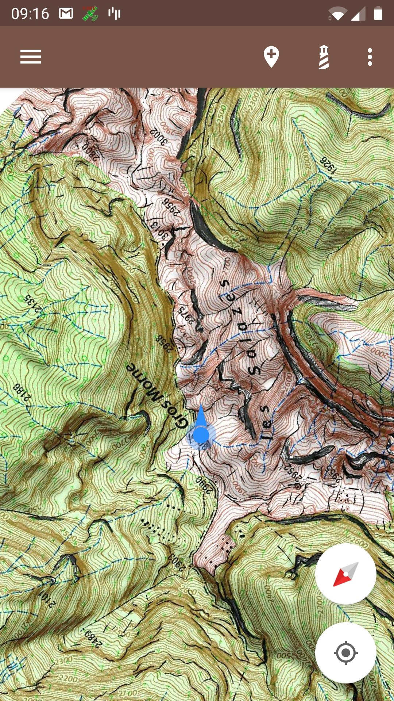

 &nbsp&nbsp&nbsp 

## Summary

1. [Overview](#overview)
2. [Features summary](#features-summary)
3. [Create a map](#create-a-map)
  * [Select an area](#select-an-area)
  * [From an archive](#import-from-an-archive)
  * [Receive a map](#map-sharing)
  * [Manual map creation](#manual-map-creation---the-hard-way)
4. [Features](#features)
  * [Measure a distance](#measure-a-distance)
  * [Show the speed](#show-the-speed)
  * [Add markers](#add-markers)
  * [Add a landmark](#add-landmarks)
  * [Lock the view on current position](#lock-the-view-on-current-position)
  * [Visualize a recording in real time](#visualize-a-recording-in-real-time)
  * [Import a GPX track](#import-a-gpx-track)
  * [GPX recording](#gpx-recording)
  * [Follow a track](#follow-a-track)
  * [Manage trails](#manage-trails)
  * [Manage markers](#manage-markers)
5. [Settings](#settings)
  * [Start on the last map](#start-on-the-last-map)
  * [Download folder](#download-folder)
  * [Rotation mode](#rotation-mode)
6. [Save your maps](#save-your-maps)
7. [Share your maps](#map-sharing)

## Overview

TrekMe is an Android trekking app to get live position on a map and other useful information, without
ever needing an internet connection (except when creating a map).
TrekMe is designed to work with any WMTS source such as USGS in USA, IGN France, Swiss topo, 
OpenStreetMap and so on. 
You can download an area of your choice so the cached tiles are available for offline usage.

Perhaps most importantly, TrekMe is _designed_ to consume few CPU resources, to preserve the device's battery. 

## Features summary

* Support in-app map creation from:
	- United States's USGS
	- France IGN (requires a subscription)
 	- Spain IGN 
 	- Swiss Topo
 	- OpenStreetMap
* Marker support (with optional comments)
* GPX tracks import
* Lock the view to the current position
* Orientation indicator
* Speed indicator
* Distance indicator
* GPX track recording
* Beacons to alert when getting close to specific locations

## Create a map

There are four ways to create a map:

1. Select an area from an official source provider like IGN or USGS,
2. Import from an archive,
3. Receive a map from a nearby TrekMe user (over Wifi),
4. Make it yourself (the hard way)

The preferred and easiest way is the first one. Below are detailed each of these methods.

### Select an area

In this mode, you use a specific map provider. Google map is a well known example of map provider. 
But their maps aren't ideal for hiking. When possible, it is better to use maps with more terrain
details. 

For example, USGS is USA's official map provider. France's IGN is ideal when you are in France and 
its territories. However, not all countries have similar service.
OpenStreetMap has a worldwide coverage. In particular, OpenStreetMap HD has a much better quality. 

Some providers require a subscription to download their maps. The others are free for maps of 
reasonable size.

From the "Create map" option menu, you get to choose between available providers:

When you've made your choice, the map appears shortly.
From there, you can zoom into the area in the world you want to capture. If this isn't the most handy
way to find your area of interest, there are others ways:

- You can center on your current location, as shown in the video below.

[Zoom on position](https://user-images.githubusercontent.com/15638794/136757539-ac589d8e-fbf4-4e71-aac0-cdac7a446c02.mp4)

- You can search for a particular place, using the search button in the top bar.
- Import a GPX track, using the menu at top-right corner. This feature is available as part of the 
Extended offer.

When you found the place you're looking for, press the area button (at the bottom-right of the screen)
so an area of selection appears. 
This area can be resized by moving the two blue circles.

If you can't reach the blue circles (after you
e.g zoomed in), pressing the area button again will make the area disapear. Pressing the button again
will make the area fit on the screen. 
 
Beware that USGS only provides detailed levels for USA. Actually, other providers only cover their 
relevant country, except for OpenStreetMap which covers the entire world.

When you're done, press the download button, at the bottom right. Except for France's IGN, for which
 an annual subscription is required, you'll see this configuration menu:

WMTS map providers have different zoom levels, generally from 1 to 18. In most cases, you don't want
levels 1 to 10 for your hike, and level 18 is not always necessary. This is why the default presets
have the minimum and maximum levels to 12 and 17 respectively. 

The number of tiles that will be downloaded depends on your choice of minimum and maximum levels.
The lower the minimum zoom, and the higher the maximum zoom, the greater is number of tiles. This
is indicated by the estimated size in Mb. Downloading hundreds of Mb may take hours..
so choose carefully your area and levels to only download the tiles you actually need.

Finally, press the download button. A download service is launched and you get a notification. From
the notification center of your Android device, you can either:

* See the download progression,
* Cancel the download

When the service finishes the download, you get a notification and a new map is available in the map
list. You can set a presentation image so you can easily identify it in the map list. To do so, 
press the edit button at the bottom left of the map card (in the map list menu). 

From the map configuration view, you can:

* Change the thumbnail image,
* Change the name,
* Save the map

#### Resume a stopped download

When a map download was stopped (either manually or e.g when shutting down the device), the map is
now incomplete. You can tell that by the warning bellow:

You can resume the download by using EDIT > "Analyze & repair". The map repair will fetch the 
missing tiles. This is possible if you have TrekMe Extended. Otherwise, it's advised to delete the 
incomplete map.

### Import from an archive

A map can also be created from an existing archive. The archive can be made by yourself or someone 
else (see below to create an archive). An archive is a zip file.
To import from an archive, use the main menu and choose "Import a map". Then, press the button 
"Import from folder" in the middle of the screen. Navigate to the folder which contains the archive(s)
and select that folder. Then, TrekMe shows you the recognized archives, which you can individually
import.

### Receive a map

See [Map Sharing](#map-sharing).

### Manual map creation - the hard way

If you own a paper map, just scan it, then prepare it to use inside TrekMe (see below). It also works
 if you have a huge single image (several Gb), as TrekMe is designed to work with arbitrary map size.
The only limitation is the memory available on your device (smartphone, tablet).

However, it's definitely not easy to create a map using this method, as basic understanding of 
localisation on a map is required. If you can, prefer the first method (area selection).

It is advised to be familiar with the following terms:
[Map projection](https://en.wikipedia.org/wiki/Map_projection),
[WGS84](https://en.wikipedia.org/wiki/World_Geodetic_System#WGS84),
[Mercator](https://en.wikipedia.org/wiki/Mercator_projection?oldid=9506890).

Beginners are strongly advised to read the Technical Basis from the [User Guide](UserGuide.md).

Then, proceed with the [Manual map creation guide](MapCreation-Manual.md).

   
## Features

### Measure a distance

Distance can be measured using two different tools in TrekMe:

*As the crow flies distance*

This is an option from the top-right menu while viewing a map: 
Adjust the distance by dragging two blue circles.

*Along track distance*

While following a track, it's sometimes handy to know the distance between two points on that track. 
For example, you can evaluate whether you have enough time to reach some point, then go around before
 nightfall.

This is an option from the top-right menu while viewing a map: "Distance on track". It can be 
activated/disabled. When enabled, two blue circles appear on the nearest track from the center of the
screen. The portion of the track between the two blue circles is highlighted in red, and its 
distance is shown.

The distance accounts for elevation *only if* the track contains elevation data for each point.

### Show the speed

The speed indicator overlays the speed in km/h at the top of the screen. Note that it requires a few 
seconds before the speed can be displayed.

### Add markers

Press the marker button to add a new marker at the center of the screen:

With its reds arrows turning around it, its shows that it can be moved by dragging the blue circle.
When you're satisfied with its position, tap on the red circle at the center. It then morphs to its 
static form.

Tapping a marker displays a popup:

From here you can:

* Navigate to the marker using Google Maps (top-right icon),
* Edit the marker (change its name and set a comment, see below),
* Move it,
* Delete it

Here is the marker edition view:

### Add landmarks

A landmark is a specific marker. A purple line is drawn between it and your current position. So it helps when you need to always know the direction of a specific place, which may be outside of the area that your screen covers.

Often, we want to display our orientation in the same time. We can also add several landmarks:

### Lock the view on current position

Sometimes, you want the view to automatically follow your position. To do that, use the menu as shown bellow:

Then select "Lock on position". Now, everytime the application gets a location update (approximately 
every 2 seconds, up to 5 seconds), the view centers on this new location.

### Visualize a recording in real time

When you start a recording from the "GPX Record" option menu, the recording can be seen in real time 
on any map that covers your current area. It appears as an orange route.

Even if you close TrekMe, you will find your live route the next time you open it, until you stop the recording.

### Import a GPX track

There's two different ways for importing a gpx track. Using the first one, you import a track for a
specific map, while using the second one you import a track for all maps which can display the track.

#### Import gpx for a specific map

While viewing a map, press the button below on the upper right corner :

Then, a list of currently available tracks opens up: 

Here you can:

* Import a new gpx files using the import button at the bottom right corner,
* Assign a color to a track,
* Manage track visibility using the "eye" button. A long click on this button changes the visibility
of all tracks.
* Remove tracks by swiping them left or right

Using the menu at the top right corner (the three vertical dots), which appears when you select a track, you can:

* Rename the selected track
* Center on the selected track on the map (only available with TrekMe Extended)

#### Import gpx for all maps

From the main menu > My trails, click on bellow the button menu, then select "Import files":

You can then select the file(s) you wish to import. The track(s) will then be imported for all maps
which can display the track(s).

Note that tracks imported this way are common to all maps. This means that deleting a track from
this screen deletes the track for all maps.

### GPX recording

It is possible to record your position and create a GPX file, to later import into a map or share
with other people.

From inside any map, there's a button at the top left corner:

The recording can be started, stopped, or paused. When recording, the location service
runs in the background. It continues to run even if TrekMe is stopped, until you decide to stop it.
If you have Android 10 or above, you need to:

- make sure that the location permission for TrekMe is set to "Allow all the time", and not just when using the app.
- ensure that the battery optimization is disabled for TrekMe 

Otherwise, some points won't be recorded and straight lines will appear on the track.

### Follow a track

Sometimes, we want to use the phone as little as possible. However, we take the risk to take a wrong
path and realize it a bit too late.

To avoid this problem, the track following feature alerts you when you get off the track. The alert
threshold is 50m by default but can be changed in the settings. This feature is only available with
"TrekMe Extended" offers.

The track following can be started from any map, in the top-right menu:

Then, select the track to follow by pressing on it on the map. The selected track is then highlighted
with a thin black stroke:

The track following feature runs as a background service, which only works when all below conditions are met:
- Battery optimization is disabled for TrekMe
- Location authorization is set to "allow all the time"
- Location is enabled on the device

### Manage trails

From the main menu > Manage trails, the list of gpx recordings appear. Four buttons at the bottom-left enable you to:

* Rename the track,
* Import the track into an existing map (press the import button at the bottom of the list, then choose the map),
* Share the gpx file (using e.g email),
* Show the elevation profile

**Multiple-selection mode**

To switch to multiple-selection mode, use button in the top bar, next to the drop-down menu.
To revert back to single selection mode, use the same button.

**Share recordings**

Whatever the selection mode, the share button below is available:

**Delete a recording**

A delete button at the bottom-right with a red trash-icon allows you to delete one or multiple
recordings. Beware the if you press that button, all selected recordings will be *permanently*
deleted.

**Automatic import of a track**

After you stop a recording, a new GPX file is added to the recordings list _and_ the corresponding
track is automatically imported into all relevant maps.
This way, it's super easy to record yourself and see your tracks on your favorite maps.

**Elevation profile**

The elevation profile allows you to know the elevation at any point of the trek. It also shows the
minimum and maximum elevations.

### Manage markers

From the main menu > Manage markers, the list of markers is shown. From this screen, you can search
for a specific marker from its name.

For each marker, several actions are possible using the drop-down menu on the right, such as centering
the map on the marker.

## Settings

Settings are accessible from the main menu > Settings.

### Start on the last map

By default, TrekMe starts on the list of maps. But it's possible to start on the last viewed map. In the "General" section > "Start TrekMe on"

### Download folder

By default, TrekMe stores everything on the internal memory. But if you have an SD card, **and** if it's mounted as portable device, you can use it to store some of your maps.

**Beware**

All your maps on the SD card will be deleted if TrekMe is uninstalled (Android enforces that).
This is the reason why it's highly recommended to save the maps you wouldn't want to loose.
To learn more about that, go to the "Save your maps" section.

In the "Root folder" section > "Selected folder", you can chose between two directories if you have an SD card. Otherwise, you can only use the internal memory:

The first directory always corresponds to the internal memory. The second, if available, corresponds to a directory on the SD card. This directory is `Android/data/com.peterlaurence.trekme/downloaded`.

Once the download folder is changed, your next map download will use it. But existing maps aren't moved.

### Rotation mode

Three rotation modes are available:

* No rotation (by default)
* Rotate only when showing orientation
* Free rotation

*Rotate only when showing orientation*

In this mode, the map is rotated along with your device's orientation *if* you enable orientation
display (while displaying a map, in the upper right menu > Show orientation).
When orientation display is enabled, a small compass appears in the bottom right of the screen - the
red side indicates the North. Whenever you like, you can disable orientation display. In this case, 
the map is aligned to the North and the compass disappears. Also note that in this mode, pressing the
compass has no effect. An example:

*Free rotation*

In this mode, you can rotate the map as will. The compass is always displayed, and pressing it aligns
the map to the North. You can also enable or disable orientation display - it won't have consequences 
on the orientation of the map.

### Save your maps

Starting from Android 10, all maps (no matter if they're on the internal memory or SD card) are
deleted when TrekMe is uninstalled. Consequently, it's highly recommended to use the backup feature
of TrekMe. You'll be able to restore your maps if you e.g change for a new device.

To create an archive, go to the list of maps and press the "EDIT" button at the bottom left:

You land on a bunch of options related to the selected map. The last option is a "Save" button - press
it. A dialog explains that you're about to choose the folder in which the archive will be created.
You can choose whatever folder you want (and create a new one), but don't select a subdirectory of
TrekMe. If you continue, the archive will be created in background - you can see the progression in
the notification area of the device.

An archive contains everything related to the map (calibration, routes, points of interest, etc.).

Once archived, a map can be restored using the import feature.

### Map sharing

A map is sometimes heavy and takes quite some time to download. When a friend also has TrekMe, it's
possible send him/her one of your maps. This feature requires the Wifi to be enabled on the two devices,
even if there is no router or hotspot in the vicinity - the sender can directly send to the receiving
device over Wifi. Make sure that the two devices stay relatively close to each other. Even if some
loads have completed successfully with several meters between the two devices, experience has shown 
that keeping the two devices close to each other lowers the risk of error.

Go ahead in the main menu > "Receive and send". There's a button to receive and another one to send.
When you choose to receive, the device is awaiting for a connection with the sender. This step can
take several minutes - please be patient. Meanwhile, the sender uses the send button and the map to send.

When the connection is established, the load starts and you can see the progression. If everything goes
well, a gorgeous emoticon is shown. Otherwise, and especially if the load got interrupted, you're advised
to start again (Wifi isn't 100% reliable).

If it really takes too long for devices to establish a connection (more than 5 min), try to restart
the receiving and sending on both phones. As last resort, reboot the two devices and retry the
procedure.

