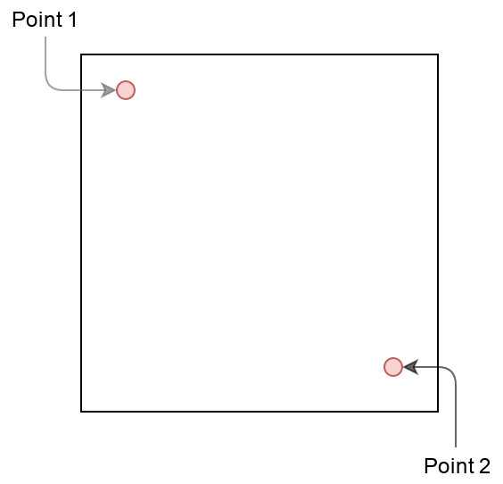

# Calibration - Tutoriel

Une carte doit être correctement calibrée pour que TrekMe vous positionne sur la carte quand un point gps est reçu. Une carte téléchargée depuis TrekMe est automatiquement calibrée. Il est donc inutile de la calibrer.

Cependant, si vous avez créé vous-même votre carte avec un outil indépendant ou si vous avez malencontreusement décalibré votre carte, alors vous devez suivre ce tutoriel. La calibration est une fonctionnalité avancée, qui ne devrait être utilisée que par les utilisateurs avertis. Ce tutoriel vise cependant à la rendre plus accessible.

## Explication

Avant de détailler comment faire en pratique, il faut comprendre le principe de la calibration.

A la réception d'un signal gps (coordonnées latitude/longitude), TrekMe doit vous positionner sur la carte. Mais il faut pour cela des points de repère (dont la position est connue) pour vous positionner relativement à ces points. Il faut au minimum deux points. Pour une calibration précise, ces deux points doivent être "diamétralement" opposés sur la carte, comme ceci :

Si le point 1 a été positionné quelque part dans le coin supérieur gauche de la carte, alors le point 2 doit être positionné quelque part dans le coin inférieur droit.

N.B. A la fin d'un téléchargement de carte, TrekMe calibre automatiquement en mettant le point 1 à l'extrémité du coin supérieur gauche, et le point 2 à l'extrémité du coin inférieur droit. C'est parce que TrekMe a obtenu les coordonnées de ces extrémités lors du téléchargement. Il est déconseillé de faire la même chose quand vous faîtes une calibration manuelle, puisque les extrémités des coins ne correspondent pas (en général) à des points caractéristiques (et donc des points dont on peut facilement connaître les coordonnées, comme vous le verrez plus loin).

## En pratique

Il faut dans un premier temps accéder à la calibration de la carte. Pour cela, dans la liste des cartes et pour la carte à calibrer, faites "Gérer". Ce qui nous intéresse ici, c'est la section "Calibration". Par exemple :

Avant de définir les points de calibration, il faut correctement choisir les bonnes valeurs pour :

1. Projection. Si vous ne savez pas de quoi il s'agit, choisissez `Pseudo Mercator`
2. Nombre de points de calibration. Choisissez 2 points.

Vous pouvez maintenant appuyer sur "Définir les points de calibration". Voici un exemple de ce qui s'affiche alors (il s'agit d'une carte déjà calibrée, manuellement):
 

Une petite explication de ce qui s'affiche, en schéma:

**Etape 1**

La première chose à choisir est le format des coordonnées des points. Va-t-on les renseigner en lat/lon, ou en coordonnées de projection ? Faites votre choix, sachant que cela n'aura pas d'impact sur la précision de la calibration. Si vous ne savez pas quoi choisir, cochez cette option. Cela veut donc dire que vous devrez récupérer les coordonnées de vos points en latitude/longitude **en degrés décimaux** (c'est détaillé plus loin comment faire). Si vous ne cochez pas cette option, il faudra utiliser les coordonnées de projection (`Pseudo Mercator` dans cet exemple ; si vous ne comprenez pas, ce n'est pas grave, cochez l'option).

**Etape 2**

A l'ouverture, le point 1 est automatiquement sélectionné. On le voit car le numéro 1 est sur fond bleu. Les points 3 et 4 sont sur fond gris car ils ne sont pas disponibles, puisque nous avons choisi de définir que deux points de calibration. On pourra alors positionner les points numérotés 1 et 2.
Le point 2 est sur fond noir, car il n'est pas sélectionné.

**Etape 3**

Il faut positionner le réticule sur un point caractéristique de la carte. Il est alors **très important** de zoomer le plus possible sur la carte. Astuce: au fur et à mesure que vous zoomez, ramenez le réticule dans votre écran pour qu'il n'en sorte pas. Le but est de placer le réticule sur un point particulier de la carte, quand elle est complètement zoomée. Dans cet exemple, voici le point 1 :

Le réticule est centré sur un point qui représente un pylone de ligne haute tension. Peu importe le point que vous choisirez, il faudra le retrouver sur le site de l'IGN comme expliqué ci-après.

**Etape 4**

Il faut maintenant récupérer les coordonnées lat/lon du point 1. Pour cela, allez sur l'[IGN Geoportail](https://www.geoportail.gouv.fr/carte) depuis un ordinateur (pas depuis un smartphone), et retrouvez la zone dans laquelle vous avez positionné le réticule. A noter que pour vous y retrouver, vous pouvez choisir la même couche que celle que vous utilisez dans votre carte. Pour cela, cliquez sur le bouton ci dessous :

Vous pouvez choisir différentes couches. Il faut savoir que par défaut, TrekMe télécharge depuis la couche "Carte IGN". Et si vous avez créé votre carte en choisissant la couche "IGN classic" dans TrekMe, cela correspond à la couche "Carte topographique IGN" dans le géoportail.

Cliquez maintenant sur le bouton outils juste en dessous des couches de carte, puis sur "Afficher les coordonnées".

Paramétrez comme affiché ci-dessus, avec pour système de référence `Geographique`, en `degrés décimaux` (sauf si vous savez ce que vous faites). 
Maitenant, quand vous déplacez le curseur de la souris sur la carte, vous voyez les `Latitude` et `Longitude` changer. L'altitude n'a pas d'importance ici. Il suffit maintenant de placer le curseur de la souris (la pointe du curseur) sur le point 1. Notez bien les latitude/longitude quelque part, et veillez à ne pas les confondre.
De retour dans TrekMe, renseignez les deux champs latitude/longitude. Indication : utilisez le point, et non la virgule, comme séparateur de nombre flottant.
Quand les deux champs sont remplis, passez à l'étape 5.

**Etape 5**

Appuyez simplement sur le bouton d'enregistrement. Et vous pouvez passer ensuite au point suivant en revenant à l'étape 2, en appuyant sur le point à définir (par exemple, le point 2). Faites exactement la même chose que pour le point 1, et n'oubliez pas de sauvegarder ensuite. Rappel : le point 2 **doit** être situé dans la zone correspondante au coin inférieur droit de la carte (ou du moins, il doit être dans la zone opposée à celle du point 1).

Quand vous avez renseigné les coordonnées et positionné les points 1 et 2, puis enregistré, vous avez fini la calibration de la carte. Si vous n'avez pas fait d'erreur, TrekMe doit vous positionner correctement sur la carte (si bien sûr la carte couvre la zone dans laquelle vous êtes).
Quand un carte est calibrée, il n'y a normalement plus de raison de revenir dessus et la modifier.

