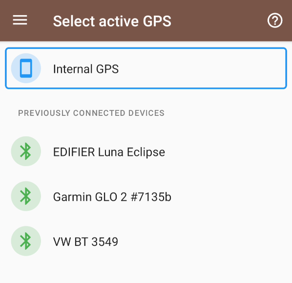
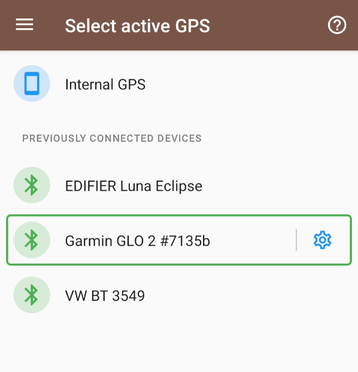
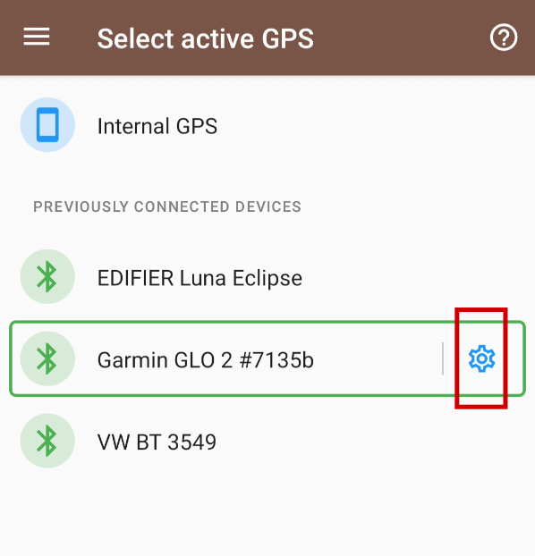

# GpsPro documentation

When navigating to GpsPro for the first time, you'll see a screen similar to this one:

This screen always shows the internal GPS first. Below are available bluetooth devices.
If your GPS device isn't among the shown list, then you should first pair it in the bluetooth
settings of your Android device.

Please note that bluetooth must be enabled for this feature to work.

## Device selection

To select a device, simply tap the line of the device of your choice.

That's it. You can go back to the map selection, and select a map. TrekMe listens for location
updates coming from your GPS device. If you don't see any location updates, there might be
connectivity issues. See the troubleshooting section below.

## Troubleshooting

For investigation purposes, you can record your GPS device activity for a short period (10 seconds).
This feature is accessible by tapping the settings icon at the end of the selected device line:

