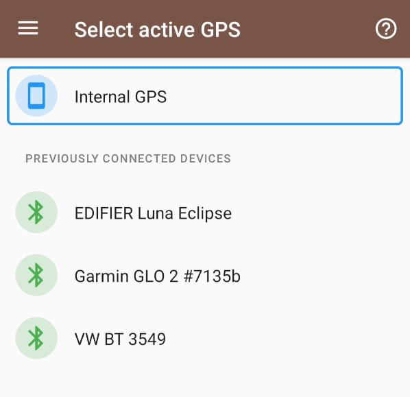
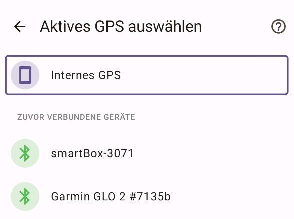
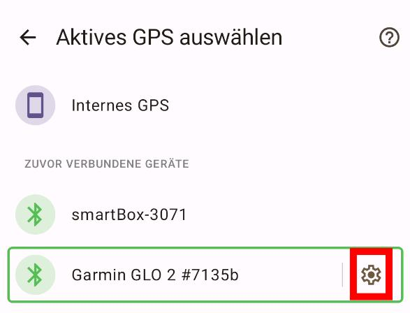

# GpsPro-Dokumentation

Wenn Sie GpsPro zum ersten Mal aufrufen, sehen Sie einen ähnlichen Bildschirm wie diesen:

Dieser Bildschirm zeigt immer zuerst das interne GPS an. Darunter sind verfügbare Bluetooth-Geräte aufgeführt.
Wenn Ihr GPS-Gerät nicht aufgelistet ist, sollten Sie es zuerst über die Bluetooth-Einstellungen Ihres
Android-Geräts koppeln.

Bitte beachten Sie, dass Bluetooth für diese Funktion aktiviert sein muss.

## GPS-Auswahl

Um ein GPS-Gerät auszuwählen, tippen Sie einfach auf die Zeile des gewünschten Geräts.

Das ist alles. Sie können zur Kartenauswahl zurückkehren und eine Karte auswählen. TrekMe empfängt Standort-Aktualisierungen von Ihrem GPS-Gerät. Wenn Sie keine Standort-Aktualisierungen sehen, stellen Sie bitte sicher, dass Ihr GPS-Gerät ordnungsgemäß konfiguriert ist. Falls das Problem weiterhin besteht, könnte es Verbindungsprobleme mit TrekMe geben. Lesen Sie den Abschnitt zur Fehlerbehebung weiter unten.

**Bitte achten Sie darauf**, ein tatsächliches GPS-Gerät auszuwählen. Andernfalls erhält TrekMe keine Standort-Daten. Es wird nicht auf die Verwendung des internen GPS zurückgreifen.

## Fehlerbehebung

Für Untersuchungszwecke können Sie die Aktivität Ihres GPS-Geräts für kurze Zeit (10 Sekunden) aufzeichnen.
Sie werden aufgefordert, den Speicherort der Aufzeichnungsdatei namens "Diagnose" auszuwählen. Bitte senden Sie mir diese Datei per E-Mail an plr.devs@gmail.com – ich werde untersuchen, warum TrekMe die Standorte nicht lesen konnte, und zukünftige Versionen mit Ihrem GPS kompatibel machen.

Diese Funktion ist zugänglich, indem Sie auf das Einstellungssymbol am Ende der Zeile des ausgewählten Geräts tippen:

