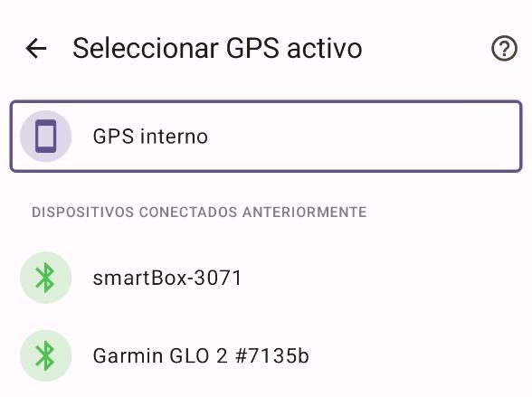
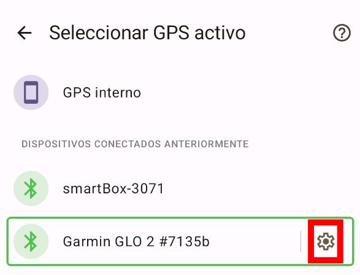

# Documentación de GpsPro

Al navegar a GpsPro por primera vez, verá una pantalla similar a esta:

Esta pantalla siempre muestra el GPS interno primero. Debajo se encuentran los dispositivos bluetooth disponibles.
Si su dispositivo GPS no está en la lista, primero debe emparejarlo desde la configuración de bluetooth de su
dispositivo Android.

Tenga en cuenta que el bluetooth debe estar habilitado para que esta función funcione.

## Selección de GPS

Para seleccionar un dispositivo GPS, simplemente toque la línea del dispositivo de su elección.

Eso es todo. Puede volver a la selección de mapas y seleccionar un mapa. TrekMe escucha las actualizaciones de ubicación
que provienen de su dispositivo GPS. Si no ve ninguna actualización de ubicación, asegúrese de que su
dispositivo GPS esté configurado correctamente. Si el problema persiste, podría haber problemas de conectividad con
TrekMe. Consulte la sección de solución de problemas a continuación.

**Tenga cuidado** de seleccionar un dispositivo GPS real. De lo contrario, TrekMe no recibirá ningún dato de ubicación.
No recurrirá automáticamente al uso del GPS interno.

## Solución de problemas

Para fines de investigación, puede grabar la actividad de su dispositivo GPS durante un corto período de tiempo
(10 segundos).
Se le pedirá que elija la ubicación del archivo de grabación, llamado "diagnosis". Por favor, envíeme
ese archivo por correo electrónico a plr.devs@gmail.com; investigaré por qué TrekMe no pudo leer las ubicaciones y
haré que las futuras versiones sean compatibles con su GPS.

Se puede acceder a esta función tocando el icono de configuración al final de la línea del dispositivo seleccionado:

