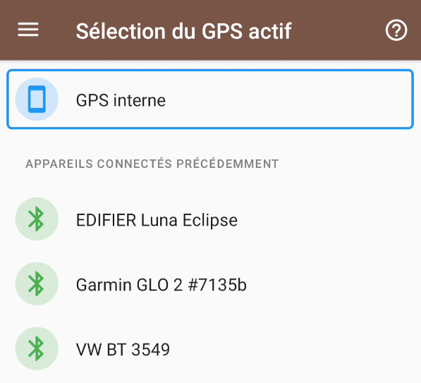
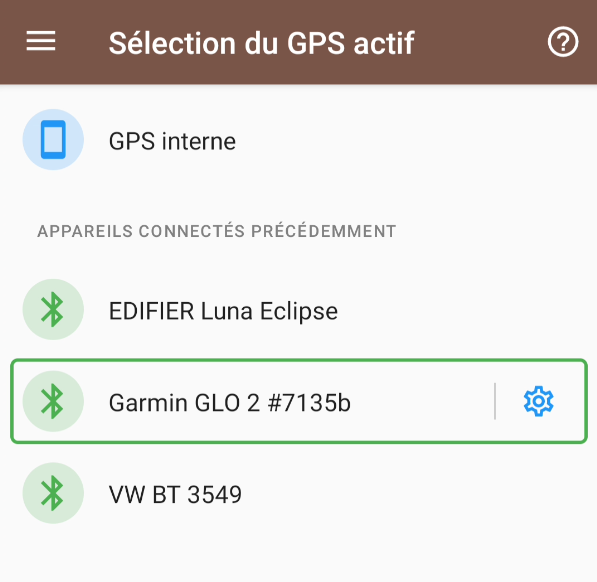
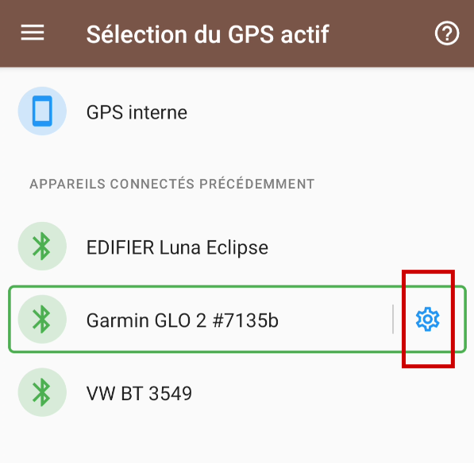

# Documentation GpsPro

Quand vous naviguez sur GpsPro pour la première fois, vous aurez un écran similaire à celui ci-dessous:

Le GPS interne est toujours listé en premier. Puis, sont listés les appareils bluetooth disponibles.
Si votre GPS ne fait pas partie de la liste, il vous faut faire un appairage depuis les réglages
bluetooth de votre appareil Android.

Veuillez noter que GpsPro ne fonctionne que si le bluetooth est activé.

## Sélection du GPS

Pour sélectionner un GPS, appuyez simplement sur la ligne de votre choix.

C'est tout. Vous pouvez revenir sur la sélection de carte, et utiliser l'application comme d'habitude.
TrekMe est à l'écoute des émissions de votre GPS et met à jour la position dès qu'un signal est reçu.
Si vous ne voyez aucune mise à jour de la position, veuillez d'abord vous assurer que le votre GPS
est correctement configuré. Si ce le problème persiste, il y a peut-être un problème de communication
 avec TrekMe. Continuez alors sur la section ci-après.

## Investigation

TrekMe intègre une foncitonnalité de diagnositic, qui consiste à enregistrer l'activité de votre GPS
pendant une dizaine de secondes. Vous serez invité à définir l'emplacement du fichier résultant (un
simple fichier texte). Veuillez m'envoyez ce fichier par mail à plr.devs@gmail.com, pour que je
l'analyse. Le but est de rendre TrekMe compatible avec votre GPS.

Pour accéder à cette fonctionnalité, appuyez sur le bouton suivant au bout de la ligne de sélection:

