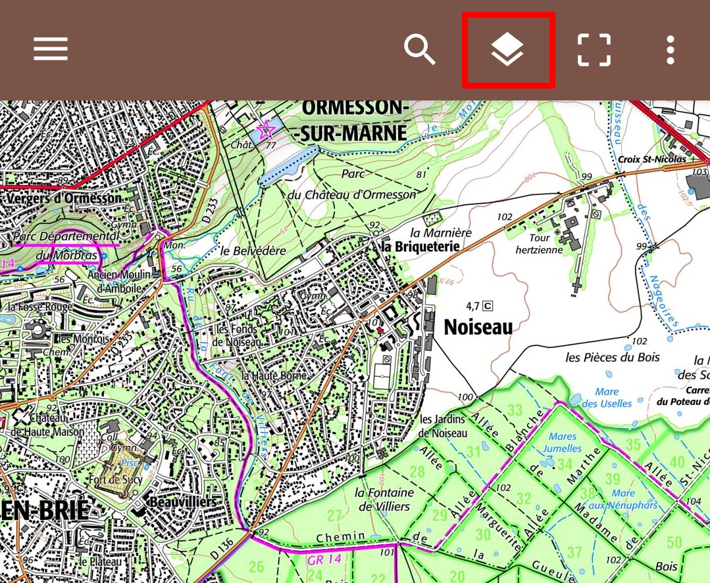

# Création de carte IGN

Lors de la création de carte IGN, il est possible de changer de couche principale. Pour changer de
couche principale, utilisez le bouton en forme de losange :

Les couches principales disponibles sont :

* Cartes IGN Classiques
* Plan IGN
* Vues aériennes

## Couches secondaires

En plus de la couche principale, vous pouvez ajouter des couches secondaires. Par exemple, si vous
êtes dans une zone montagneuse, vous pouvez ajouter la carte des pentes (qui indique le dégré des
pentes avec un dégradé de couleurs - c'est très utile pour identifier les zones à rique d'avalanche).

Pour cela, allez dans le menu en haut à droite > "Superposer des couches".
Pour le moment, les couches disponibles sont:

* Carte des pentes
* Parcelles cadastrales

Pour voir l'aperçu, revenez en arrière sur la création de carte. Notez qu'ajouter des couches ralentit
l'affichage de la carte car il y a plus de données à télécharger.

### Opacité

Pour chaque couche secondaire sélectionnée, vous pouvez choisir l'opacité. En effet, ces couches sont
dessinées au dessus de la couche principale, et vous voulez peut-être voir la couche principale en 
transparence. Cependant, pour les parcelles cadastrales, il est conseillé de mettre l'opacité à 1.

### Ordre des couches

Les couches secondaires sont dessinées dans l'ordre dans lequel elles apparaissent dans la liste (du
haut vers le bas). Vous pouvez changer cet ordre en déplaçant les couches par sélection de leur 
bouton sur le côté droit. Bien entendu, ce n'est pas utile si vous n'avez ajouté qu'une seule couche.

### Suppression d'une couche

Avec votre doigt, appuyez sur le nom d'une couche et glissez-la rapidement sur la droite ou la gauche.

